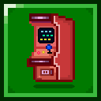

#  Arcade


Arcade is a server-side Minecraft api made in Kotlin, providing
a wide array of functionality primarily aimed at server-sided
minigame development.

Arcade has been broken down into separate modules, the documentation
for each can be found below:

## Modules

> ### [Commands](./docs/arcade-commands/getting-started.md)
> ### [Datagen](./docs/arcade-datagen/getting-started.md)
> ### [Dimensions](./docs/arcade-dimensions/getting-started.md)
> ### [Events](docs/arcade-events-server/getting-started.md)
> ### [Extensions](./docs/arcade-extensions/getting-started.md)
> ### [Items](./docs/arcade-items/getting-started.md)
> ### [Minigames](./docs/arcade-minigames/getting-started.md)
> ### [Resource Packs](./docs/arcade-resource-pack/getting-started.md)
> ### [Resource Pack Hosting](./docs/arcade-resource-pack-host/getting-started.md)
> ### [Scheduling](./docs/arcade-scheduler/getting-started.md)
> ### [Utilities](./docs/arcade-utils/getting-started.md)
> ### [Visuals](./docs/arcade-visuals/getting-started.md)
> ### [World Border](docs/arcade-boundaries/getting-started.md)

## Adding to dependencies

If you are developing minigames using arcade, you will want to include
all the modules, you can do this by adding the following to your
`build.gradle.kts`.

```kts
repositories {
    maven("https://maven.supersanta.me/snapshots")
}

dependencies {
    include(modImplementation("net.casualchampionships:arcade:0.5.1-beta.2+1.21.6")!!)
}
```


