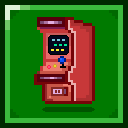

#  Arcade


<!-- #region about -->
## About the Project

Arcade is a server-side Minecraft api made in Kotlin, providing
a wide array of functionality primarily aimed at server-sided
minigame development.

Arcade is built up of many different modules, a few notable ones
include, supporting custom runtime dimensions, replay recording/playback,
a virtual (packet based) entity system, and a minigame api. A list of
all the modules available can be found in the [documentation](https://arcade.casualchampionships.net).

## Adding to your Project

If you are developing minigames using arcade, you will want to include
all the server-side modules, you can do this by adding the following to your
`build.gradle.kts`.

```kts
repositories {
    maven("https://maven.casualchampionships.net/snapshots")
}

dependencies {
    include(implementation("net.casualchampionships:arcade:0.13.1-beta.1+26.2")!!)
}
```

Alternatively, if you do not want to bundle the whole of arcade, each of the
modules are published separately. You can see the [documentation](https://arcade.casualchampionships.net)
for more information.
<!-- #endregion about -->

## Documentation

The api's documentation can be found [here](https://arcade.casualchampionships.net).

The documentation details how to get started with each of Arcade's modules and what features they provide.

## License

Distributed under the MIT License. See [MIT License](https://opensource.org/licenses/MIT) for more information.
