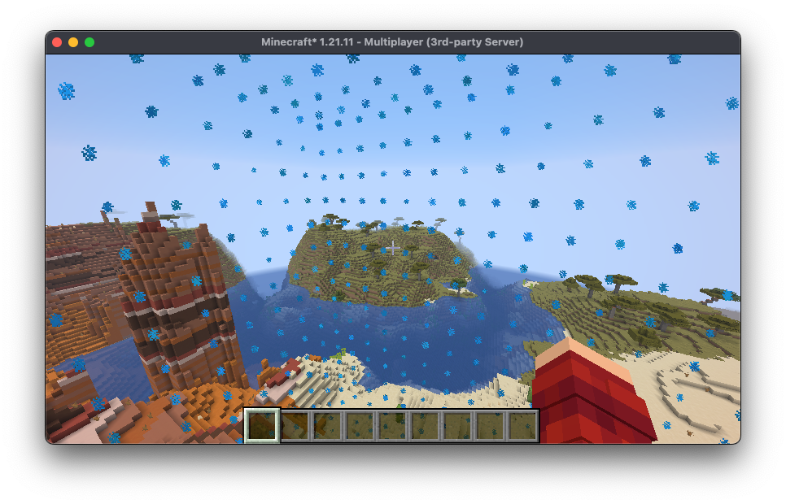
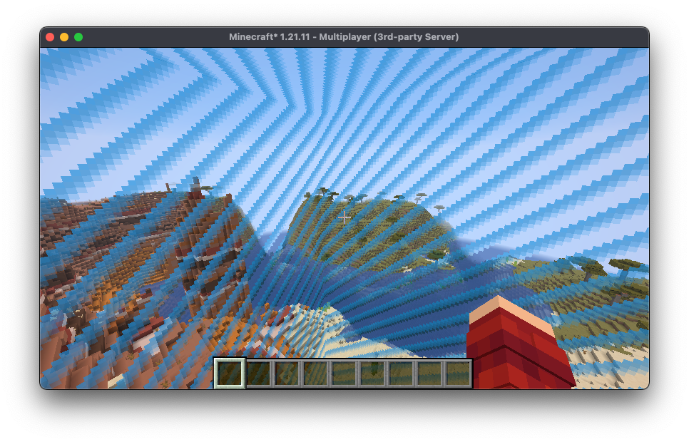

# Usage

## Creating a Boundary

Boundaries are formed from two components, a shape and a renderer which
are represented by `BoundaryShape` and `BoundaryRenderer` respectively.

Currently, the only `BoundaryShape` that arcade provides is
`AxisAlignedBoundaryShape`, which is essentially just a dynamic
axis aligned bounding box. Other boundary shapes are planned, for 
example a spherical or cylindrical boundary shape.

We can create an `AxisAlignedBoundaryShape` as follows:
```kotlin
val box: AABB = // ...
val shape = AxisAlignedBoundaryShape(box)
```

As for `BoundaryRenderer` there are two main provided options being
`ParticleBoundaryRenderer` (or `AsyncParticleBoundaryRenderer`)
and `AxisAlignedDisplayBoundaryRenderer`. 

We'll start with the particle renderer, which renders the boundary 
using particles, we can specify custom particle options which can
change the particles that the boundary uses for rendering, by default
it will use blue, red, and green dust particles for stationary, shrinking,
and growing respectively. We can also specify the range at which
particles will be visible to players and the number of particles
per block to render.

```kotlin
val shape: BoundaryShape = // ...
val renderer = ParticleBoundaryRenderer(
    shape = shape,
    particles = ParticleRenderOptions.DEFAULT,
    range = 40.0,
    particlesPerBlock = 1.0
)
```
Our renderer would look like this in game:


Now let's have a look at `AxisAlignedDisplayBoundaryRenderer`, this renderer
uses display entities to render the boundary. The constructor takes in
`AxisAlignedModelRenderOptions` which dynamically specifies what the model
for each of the faces should be.
```kotlin
val shape: BoundaryShape = // ...
val renderer = AxisAlignedDisplayBoundaryRenderer(
    shape = shape, 
    models = AxisAlignedModelRenderOptions.DEFAULT
)
```
By default, the models are the light blue, red, and lime stained-glass
textures, but we can actually use shaders to create a more faithful
world-border-like recreation. Arcade comes with 
`AxisAlignedModelRenderOptions.CUBOID_SHADER` and
`AxisAlignedModelRenderOptions.CUBE_SHADER` options which render the
animated world border texture on the boundary faces.

The difference between the two is that the cuboid shader will work
for boundaries that have a different x, y, and z size but only when
the sizes are in the range `[0.5..32760]`. The cube shader will only
work for boundaries where the x, y, and z sizes are equal but works
for the entire 32-bit floating point range.

```kotlin
val shape: BoundaryShape = // ...
val renderer = AxisAlignedDisplayBoundaryRenderer(shape, AxisAlignedModelRenderOptions.CUBOID_SHADER)
```

This is what the shader version looks like in game:


Putting this together we can actually create an instance of `LevelBoundary`:
```kotlin
val box: AABB = // ...
val shape = AxisAlignedBoundaryShape(box)
val renderer = AxisAlignedDisplayBoundaryRenderer(shape, AxisAlignedModelRenderOptions.CUBOID_SHADER)
val boundary = LevelBoundary(shape, renderer)
```

And then we can assign it to a given world:
```kotlin
val level: ServerLevel = // ...
level.levelBoundary = boundary
```

## Boundary Behavior

Boundaries are intended to behave very similar to world borders, but
they do differ slightly. Boundaries also support the y-axis and so boundaries
have an x-size, y-size, and z-size instead of just one size which is applied
to the x and z axis. Boundaries also allow lerping the center of the boundary
over a period of time.

```kotlin
val boundary: LevelBoundary = // ...
// If duration is not specified it defaults to 0 (instant)
boundary.resize(size = Vec3(100.0, 256.0, 80.0), duration = 5.Minutes)

// Default to 0 duration
boundary.recenter(Vec3(0.0, 64.0, 0.0), duration = 3.Minutes)
```

Boundaries also support damaging players outside of them exactly like the 
vanilla world border:
```kotlin
val boundary: LevelBoundary = // ...
boundary.damagePerBlock = 0.4
boundary.damageSafeZone = 10.0
boundary.warningBlocks = 10
```