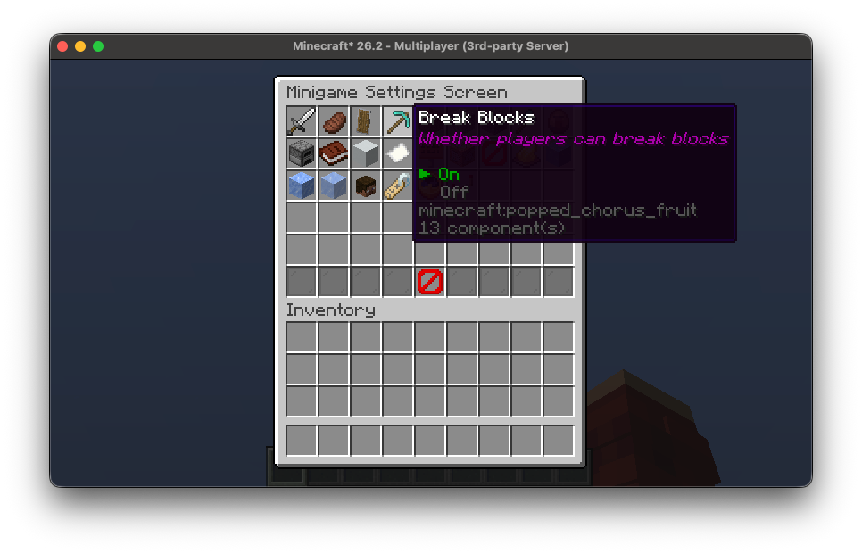
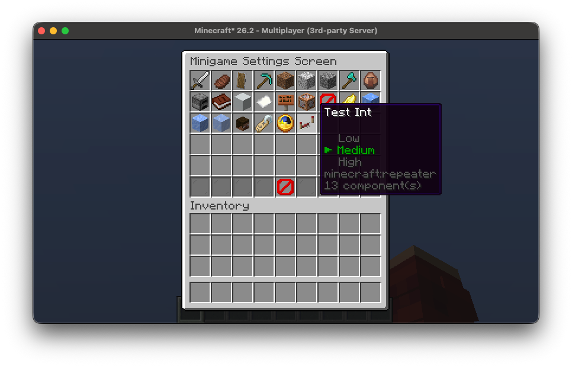

# Settings

Minigame settings are super easy to configure and allow for quite a lot of control over the behaviour of your minigame.

In addition to the built-in default settings, you are able to implement your 
own settings using this system, all the settings are accessible and 
configurable in-game through a gui.



## Built-In Settings

All the built-in settings are defined in the `MinigameSettings` class, these 
are accessible through `Minigame#settings`, we'll discuss some of them and what
they do.

Let's say we're creating a multi-player parkour minigame, it's likely we don't 
want players to be able to punch each other, to do this we can simply disable 
PvP:

```kotlin
minigame.settings.canPvp.set(false)
```

We'd also want the players to stay in full hunger:
```kotlin
minigame.settings.canGetHungry.set(false)
```

And we don't want the player to modify our parkour maps:
```kotlin
minigame.settings.canBreakBlocks.set(false)
minigame.settings.canPlaceBlocks.set(false)
```

There are also some more admin-related settings, for example:
```kotlin
minigame.settings.isChatMuted.set(true)
```
This will mute chat and prevent players from sending messages.

There are also some settings to aid with tick-freezing the minigame, for example, if you want your minigame to freeze all ticking when the minigame is paused:
```kotlin
minigame.settings.tickFreezeOnPause.set(true)
```

Or even if you just want to freeze all entities (including players) at a given moment:
```kotlin
minigame.settings.tickFreezeEntities.set(true)
```

These settings work on a level-wide basis, depending on the worlds you 
registered for your minigame, it doesn't affect other minigames or worlds that 
aren't part of your minigame. For more information, go back to the [World Section](./worlds.md).

There are more settings for you to explore, be sure to take a look at the class
to see what is available!

## Custom Settings

To create custom settings for your minigame, you first must extend the 
`MinigameSettings` class.

```kotlin
class ExampleSettings(minigame: Minigame): MinigameSettings(minigame) {

}
```

And then override the `settings` field in your minigame to use it:
```kotlin
class ExampleMinigame(
    server: MinecraftServer,
    uuid: UUID
): Minigame(server, uuid, ID, ExamplePhase.entries) {
    override val settings: ExampleSettings = ExampleSettings(this)

    // ...
}
```

### Setting Types

The underlying class for all settings is `GameSetting<T>`, this is essentially 
just a wrapper for some value with any type `T`. The type of the value is
described by a `GameSettingType<T>`, which is what knows how to serialize it,
and there are a couple built-in types that this supports:
```kotlin
GameSettingType.BOOL
GameSettingType.INT32
GameSettingType.INT64
GameSettingType.FLOAT32
GameSettingType.FLOAT64
GameSettingType.STRING
GameSettingType.IDENTIFIER
GameSettingType.TIME
GameSettingType.enumeration<E>()
GameSettingType.optionalEnumeration<E>()
```

These will likely be all you need, however, creating your own type is super simple:
```kotlin
// Use Codec<T> for your type, in this example using a Vec3
val vec3SettingType = GameSettingType(Vec3.CODEC)
```

### Building a Custom Setting

We build `GameSetting<T>`s with a `GameSettingBuilder<T>`, and each of the 
built-in types has a matching builder function:
```kotlin
GameSettingBuilder.bool()
GameSettingBuilder.int32()
GameSettingBuilder.int64()
GameSettingBuilder.float32()
GameSettingBuilder.float64()
GameSettingBuilder.string()
GameSettingBuilder.id()
GameSettingBuilder.time()
GameSettingBuilder.enumeration<E>()
GameSettingBuilder.optionalEnumeration<E>()
```

For a custom type you can construct the builder directly with your
`GameSettingType`:
```kotlin
val builder = GameSettingBuilder(vec3SettingType)
```

Now to use the builder, the first thing we want to do is give the setting a name, and a default value:
```kotlin
val setting: GameSetting<Int> = GameSettingBuilder.int32 {
    name = "my_setting"
    value = 100
}
```

This is the minimum you need to create a `GameSetting`, however it is only
displayed in the gui if you give it a display item, whose name labels the
setting:
```kotlin
val setting: GameSetting<Int> = GameSettingBuilder.int32 {
    name = "test_setting"
    value = 50
    display = Items.REPEATER.named("Test Int")
}
```

It's also likely you want to add some options - these are the values that an
admin can pick between, and each one has a name which labels the value in the
gui. Clicking the setting cycles forwards through the options, and right-clicking 
cycles backwards:
```kotlin
val setting: GameSetting<Int> = GameSettingBuilder.int32 {
    // ...
    option("first_option", Component.literal("Low"), 0)
    option("second_option", Component.literal("Medium"), 50)
    option("third_option", Component.literal("High"), 100)
}
```

In-game your setting would look like this: 


A setting isn't restricted to its options, they're just the values that can be
picked in the gui; the value can always be set to anything in code or with the
`/minigame settings` command.

We can also add listeners to our setting to get notified when the setting is changed:
```kotlin
val setting: GameSetting<Int> = GameSettingBuilder.int32 {
    // ...
    onChange { setting: GameSetting<Int>, previous: Int, value: Int ->
        println("My Setting was set to $value")
    }
}
```

There is a similar `onApply`, which differs in that it is also called when the
minigame initializes, including after a minigame has been loaded back from disk.
This is what you want if a setting has to keep something else in sync with its
value, rather than just reacting to a change:
```kotlin
val setting: GameSetting<Int> = GameSettingBuilder.int32 {
    // ...
    onApply { setting: GameSetting<Int>, value: Int ->
        println("My Setting is $value")
    }
}
```

And finally we can add setting overrides, this is for the case of 
player-specific settings, and is mostly designed to add overrides for 
administrators. For example, the `isChatMuted` setting has an override that 
will let any minigame admins bypass the mute.
```kotlin
val setting: GameSetting<Int> = GameSettingBuilder.int32 {
    // ...
    
    // If the player this setting is being applied
    // to is an admin, the value will be 900
    override(isAdminOverride(900))
    
    // This can be any function
    override { player: ServerPlayer ->
        player.experienceLevel
    }
}
```

An override returns `null` if it doesn't apply to that player, in which case the
setting's own value is used. To read a setting with the overrides applied, pass
the player when getting the value:
```kotlin
val setting: GameSetting<Int> = // ...
val player: ServerPlayer = // ...

// The setting's value, ignoring any overrides
val value: Int = setting.get()
// The setting's value for this specific player
val overridden: Int = setting.get(player)
```

### Registering Custom Settings 

Now inside our class we can register our first setting, we can do this by using
the `register` method. This takes in a `GameSetting<T>` and returns it, so we 
can assign it in one go:

```kotlin
class ExampleSettings(minigame: Minigame): MinigameSettings(minigame) {
    val myTestSetting: GameSetting<Int> = this.register(GameSettingBuilder.int32 {
        name = "test_setting"
        value = 50
        display = Items.REPEATER.named("Test Int")

        option("first_option", Component.literal("Low"), 0)
        option("second_option", Component.literal("Medium"), 50)
        option("third_option", Component.literal("High"), 100)

        onChange { setting: GameSetting<Int>, previous: Int, value: Int ->
            println("My Setting was set to $value")
        }
        
        override { player: ServerPlayer ->
            player.experienceLevel
        }
    })
}
```

This will register the setting for the minigame and will add it to the list to 
be displayed in the gui.

`GameSetting<T>` can also be delegated, this means alternatively we could write
our setting like so:
```kotlin
class ExampleSettings(minigame: Minigame): MinigameSettings(minigame) {
    var myTestSetting: Int by this.register(GameSettingBuilder.int32 {
        // ...
    })
}
```

This means we can directly get and set the value of the setting:
```kotlin
val settings: ExampleSettings = // ...
println("The value of My Custom Setting is: ${settings.myCustomSetting}")
settings.myCustomSetting = 99
```

### Default Options

Some setting types have an obvious set of options; a `GameSetting<Boolean>` can
only have two, one for `true`, and one for `false`, and an enum setting has one
per constant. Instead of adding options for these manually, we can just use
`defaultOptions`:
```kotlin
class ExampleSettings(minigame: Minigame): MinigameSettings(minigame) {
    val myCustomSetting by this.register(GameSettingBuilder.bool {
        // ...
        defaultOptions()
    })

    val myEnumSetting by this.register(GameSettingBuilder.enumeration<ExampleEnum> {
        // ...
        defaultOptions()
    })
}
```

