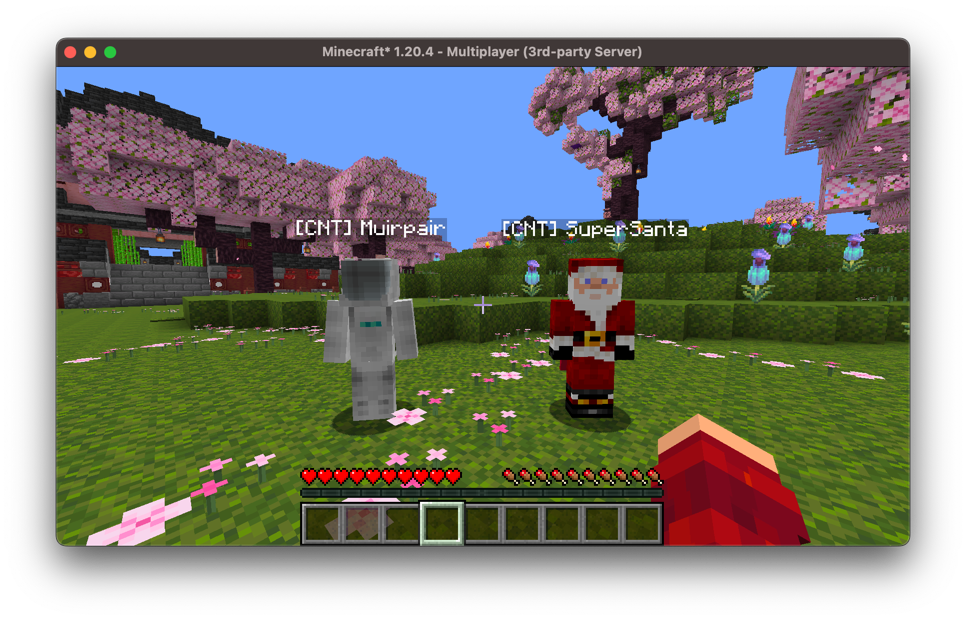
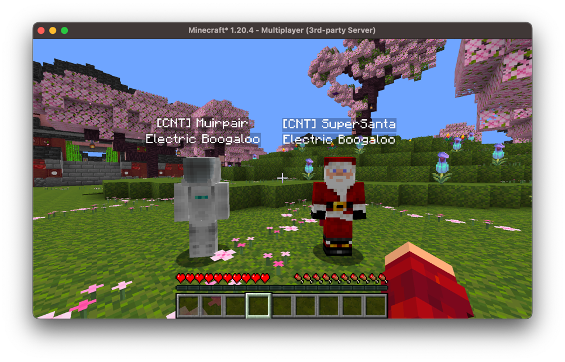

# Creating Nametags

Nametags in vanilla are quite limiting, entities can only really display their 
single name, and you have very little control over what is shown or who can see 
it. Arcade's nametags module lets you attach fully customizable nametags to 
*any* entity, display multiple nametags at once, and configure exactly who can 
see each one.

Nametags are represented by the `Nametag` interface, and we add and remove them 
from an entity through its `nametagExtension`.

Usually you'll want the nametag to depend on the entity it's attached to, so we 
implement the `Nametag` interface ourselves. This requires us to override 
`getComponent`, which returns the component to display for a given observee, and 
`isObservable`, which determines whether an observer can see the nametag.

For example, we can create a nametag that prefixes each player with their own name:
```kotlin
class CNTNametag: Nametag {
    override fun getComponent(observee: Entity): Component {
        return Component.literal("[CNT] ${observee.name.string}")
    }

    override fun isObservable(observee: Entity, observer: Observer): Boolean {
        return true
    }
}
```

Because `getComponent` is passed the observee, a single instance of our nametag 
can be added to many players and each will display their own name:
```kotlin
val server: MinecraftServer = // ...
val nametag = CNTNametag()
for (player in server.playerList.players) {
    player.nametagExtension.add(nametag)
}
```



We'll take a deeper look at controlling visibility with `isObservable`, as well 
as the other things we can customize, in the 
[Customizing Nametags](customizing-nametags.md) section.

## Simple Nametags

If you just want a static nametag that displays the same component to everyone, 
you don't need to implement the interface yourself, you can use `Nametag.simple`:
```kotlin
val boogaloo = Nametag.simple(Component.literal("Electric Boogaloo"))
```

## Multiple Nametags

Unlike vanilla, an entity can have as many nametags as you please; they will be 
stacked above the entity. Here we give a player both the `[CNT]` name tag from 
before and the static "Electric Boogaloo" nametag:
```kotlin
val server: MinecraftServer = // ...

val nametag = CNTNametag()
for (player in server.playerList.players) {
    player.nametagExtension.add(nametag)
    player.nametagExtension.add(boogaloo)
}
```



## Removing Nametags

We can remove a specific nametag, remove all of them, or query the current 
nametags on an entity:
```kotlin
val entity: Entity = // ...
val nametag: Nametag = // ...

entity.nametagExtension.remove(nametag)
entity.nametagExtension.removeAll()

val nametags: Collection<Nametag> = entity.nametagExtension.all()
```
