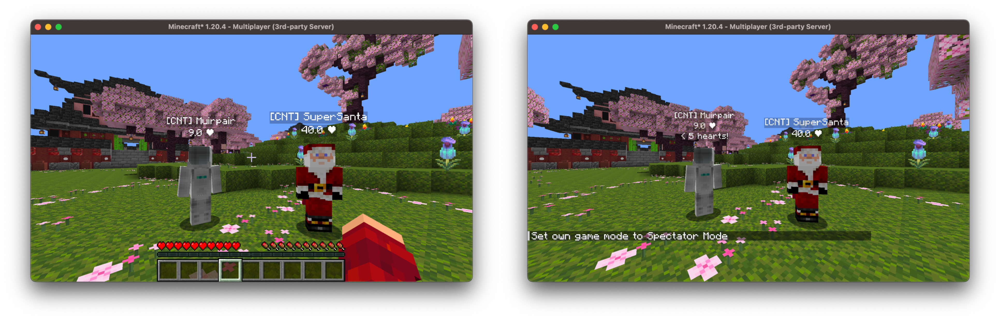

# Customizing Nametags

Beyond the component that's displayed, the `Nametag` interface has a number of 
methods you can override to control how and when your nametag is shown.

## Update Interval

`updateInterval` controls how often `getComponent` (and the visibility
checks) are re-evaluated. By default, this happens every tick, but if your nametag
is expensive to compute or doesn't need to update that frequently, you can
increase it.

For example, a nametag that displays a player's health doesn't need to refresh
every single tick:
```kotlin
class HealthNametag: Nametag {
    override val updateInterval: MinecraftTimeDuration
        get() = 5.Ticks

    override fun getComponent(observee: Entity): Component {
        val health = if (observee is LivingEntity) observee.health else 0.0F
        return Component.literal("$health ❤")
    }

    override fun isObservable(observee: Entity, observer: Observer): Boolean {
        return true
    }
}
```

## Visibility

The `isObservable` method determines, per observer, whether a nametag should be 
visible. This is one of the required methods, but it's also where a lot of the 
power of the nametags system comes from. For example, we could display a warning 
nametag that only spectators can see, and only when the observee is low on health:

```kotlin
class LowHealthWarningNametag: Nametag {
    override fun getComponent(observee: Entity): Component {
        return Component.literal("< 5 hearts!")
    }

    override fun isObservable(observee: Entity, observer: Observer): Boolean {
        // Only spectators can see this nametag, and only when the
        // observee is below 5 hearts
        val player = observer.asPlayerOrNull() ?: return false
        return player.isSpectator && observee is LivingEntity && observee.health < 10
    }
}
```



We can also limit visibility by range, and whether the nametag is visible through 
walls:
```kotlin
class RangedNametag: Nametag {
    override fun getComponent(observee: Entity): Component {
        return Component.literal("Nearby!")
    }

    override fun isObservable(observee: Entity, observer: Observer): Boolean {
        return true
    }

    // Only visible within 16 blocks
    override fun isWithinRange(observee: Entity, observer: Observer): Boolean {
        val player = observer.asPlayerOrNull() ?: return false
        return player.distanceToSqr(observee) < 16.0 * 16.0
    }

    // Hidden when the observee is behind a wall (and not sneaking)
    override fun isVisibleThroughWalls(observee: Entity): Boolean {
        return false
    }
}
```

## Height

By default, a nametag takes up a single line of text directly above the entity's 
head (`NametagHeight.DEFAULT`). If your nametag is taller, or you want to offset 
it, you can override `height`:
```kotlin
override val height: NametagHeight
    get() = NametagHeight.of(0.55) // Roughly two lines of text
```

## Background Color

The `backgroundColor` controls the color rendered behind the nametag text. 
Returning `null` (the default) uses Minecraft's default background:
```kotlin
override val backgroundColor: ColorARGB?
    get() = ColorARGB(0x80000000.toInt()) // Semi-transparent black
```
