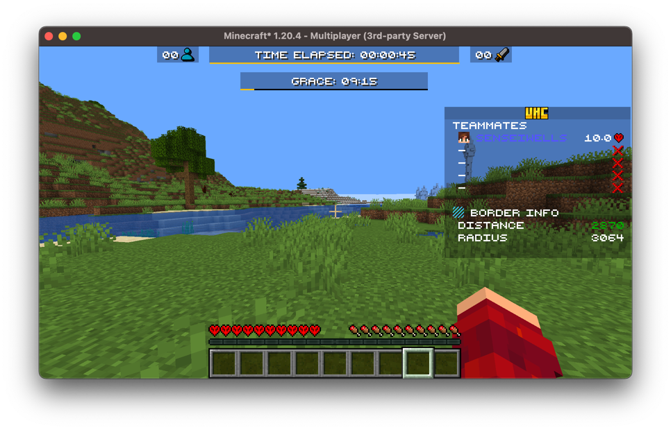

# Bossbars

Bossbars are great for displaying ui at the top of the player's screen, they're useful as
you're able to display multiple bossbars at a time.

## Creating A Bossbar

Each part of a `VirtualBossbar` is a [value](values.md) which we can set:

```kotlin
val bossbar = VirtualBossbar()
bossbar.title.set(Component.literal("My Bossbar"))
bossbar.progress.set(0.5F)
bossbar.color.set(BossBarColor.BLUE)
bossbar.overlay.set(BossBarOverlay.PROGRESS)

val player: ServerPlayer = // ...
bossbar.startObservingAndSendPackets(player.asObserver())
```

This will result in the following bossbar:


As well as the `title`, `progress`, `color`, and `overlay`, a bossbar also has `dark`,
`music`, and `fog`, which darken the sky, play boss music, and create world fog
respectively.

If we change any of these later, the bossbar needs to be ticked for the change to be
displayed:

```kotlin
bossbar.progress.set(0.75F)
bossbar.tick()
```

We can also override any of these values for a single player:

```kotlin
bossbar.title.set(Component.literal("Welcome!"))

// Only this player is shown their own name
bossbar.title.set(player, Component.literal("Welcome, ${player.scoreboardName}!"))
```

## Generating A Bossbar

Instead of setting each value ourselves, a `DynamicVirtualBossbar` can generate them from
[elements](elements.md) every tick:

```kotlin
val bossbar = DynamicVirtualBossbar(server)
bossbar.setTitle { player -> player.displayName }
// Progresses throughout a minecraft day
bossbar.setProgress(UniversalElement { server ->
    (server.tickCount % 24_000) / 24_000.0F
})
bossbar.setColor(LevelSpecificElement { level ->
    when (level.dimension()) {
        Level.NETHER -> BossBarColor.RED
        Level.END -> BossBarColor.PURPLE
        else -> BossBarColor.BLUE
    }
})
```

This results in the following bossbar:


A `UniversalElement` generates the base value and any other element generates per-player
overrides, and each value can have both. Any value that doesn't have an element can still
be set directly.

## Timer Bossbars

Bossbars are great for displaying timers due to their nature of having a progress bar. A
`TimerElement` is a countdown which we can display with a bossbar:

```kotlin
val timer = TimerElement(10.Minutes)

val bossbar = DynamicVirtualBossbar(server)
bossbar.addTickable(timer)
bossbar.setProgress(timer.progress())
bossbar.setTitle(timer.remaining { duration -> Component.literal(duration.formatHHMMSS()) })
```

The elements returned by `progress()` and `remaining` only read the timer, so we register
the timer itself with `addTickable` to make it count down. This means the timer counts
down once per tick no matter how many values are displaying it, and it also lets us
display the same timer with a sidebar or tab display at the same time.

We can control the timer at any point:

```kotlin
// Resets the timer and sets the duration to 10-minutes
timer.setTotalDuration(10.Minutes)

// Doesn't reset the timer, instead sets it to finish in 5-minutes from now
timer.setRemainingDuration(5.Minutes)

// Unset the timer
timer.removeDuration()

// Whether the countdown has finished
if (timer.complete) {
    // ...
}
```

> [!NOTE]
> A timer only counts down while it's being ticked. If you're using one without a dynamic
> visual, you'll need to call `timer.tick(server)` yourself.

If we want the bar to be shorter than the full width, we can scale the progress:

```kotlin
bossbar.setProgress(UniversalElement { MathUtils.centeredScale(timer.getProgress(), 0.75F) })
```

For example, like the grace bossbar in the image below, to achieve this effect, you can
create a resource pack and change one of the bossbar color textures to be shorter.


