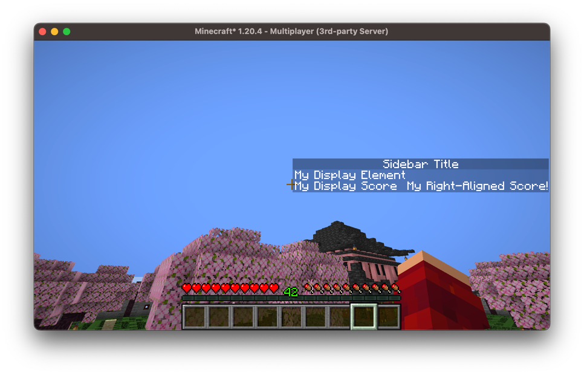
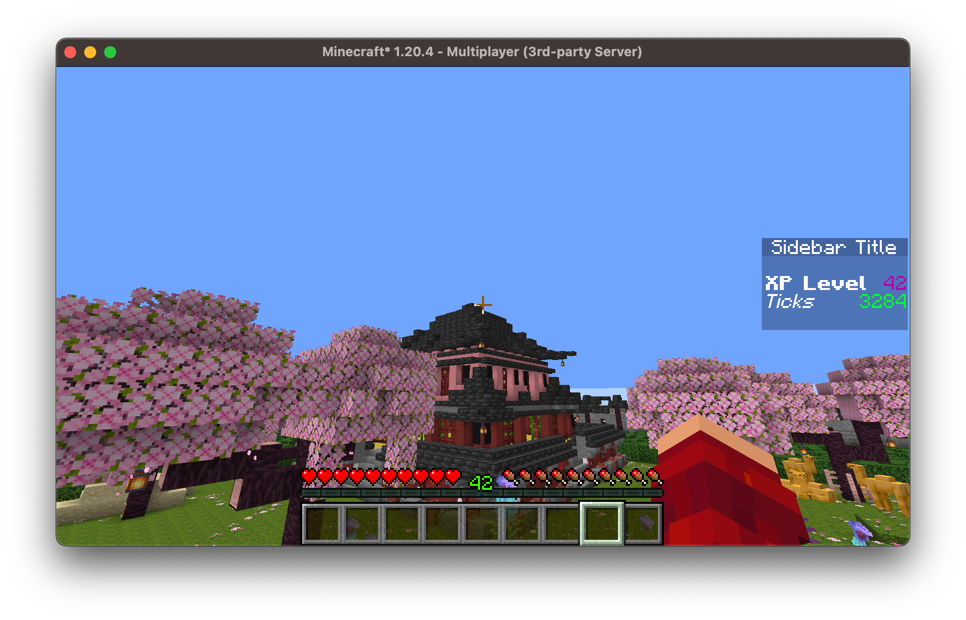

# Sidebar

The sidebar is a very powerful tool that minigames have to display user interfaces.
Arcade provides an api to display ui on a per-player basis dynamically. We can display up
to 15 rows of text on the side of our player's screens.

## Sidebar Components

Each row of a sidebar is a `SidebarComponent`, which has a display component, aligned to
the left, and optionally a score component, aligned to the right:

```kotlin
SidebarComponent.withNoScore(Component.literal("My Display Element"))

SidebarComponent.withCustomScore(
    Component.literal("My Display Score"),
    Component.literal("My Right-Aligned Score!")
)
```

There are also two special components; `SidebarComponent.EMPTY` which displays a blank
row, and `SidebarComponent.NONE` which is the absence of a row, and isn't displayed at
all.

## Creating A Sidebar

A `VirtualSidebar` has a title and up to `MAX_SIZE` rows, all of which are
[values](values.md). Row `0` is the bottom row of the sidebar:

```kotlin
val sidebar = VirtualSidebar()
sidebar.title.set(Component.literal("Sidebar Title"))

sidebar.row(1).set(SidebarComponent.withNoScore(Component.literal("My Display Element")))
sidebar.row(0).set(SidebarComponent.withCustomScore(
    Component.literal("My Display Score"),
    Component.literal("My Right-Aligned Score!")
))
```

These elements would result in a sidebar looking like so:


We don't have to specify how many rows our sidebar has. Rows start out as
`SidebarComponent.NONE` and the sidebar is as tall as its highest set row, so setting a
row grows the sidebar to include it, and setting it back to `NONE` shrinks it again:

```kotlin
sidebar.row(4).set(row)                     // The sidebar is now 5 rows tall
sidebar.row(4).set(SidebarComponent.NONE)   // And back to however tall it was
```

Any row below the highest one that we haven't set is displayed blank, so we can leave
gaps in our sidebar.

If it's easier to think about the sidebar as a whole, we can set every row at once with
`setRows`, which will clear any row beyond the ones we give it. This takes the rows
bottom-first, so it's usually easier to build them with `SidebarComponents`, which takes
them in the order they're displayed:

```kotlin
sidebar.setRows(SidebarComponents.of(
    SidebarComponent.withNoScore(Component.literal("Top row")),
    SidebarComponent.withNoScore(Component.literal("Bottom row"))
))
```

`SidebarComponents` also lets us add rows from a `Component` directly:

```kotlin
val rows = SidebarComponents.empty()
    .addRow(Component.literal("Top row"))
    .addRow(Component.literal("Score row"), Component.literal("42"))
```

## Per-Player Rows

Since rows are values, we can override an individual row for a single player:

```kotlin
sidebar.row(0).set(player, SidebarComponent.withNoScore(Component.literal("Just for you!")))
```

Or override all of their rows at once, and set them back to what everyone else is being
displayed:

```kotlin
sidebar.setRows(player, listOf(bottom, top))

sidebar.setRowsToBase(player)
```

## Generating A Sidebar

Instead of setting our rows ourselves, a `DynamicVirtualSidebar` can generate the title
and rows from [elements](elements.md):

```kotlin
val sidebar = DynamicVirtualSidebar(server)
sidebar.setTitle(ComponentElements.of(Component.literal("Sidebar Title")))

// Displays the player's xp level
sidebar.setRow(1) { player ->
    SidebarComponent.withCustomScore(
        Component.literal("XP Level").bold(),
        Component.literal(player.experienceLevel.toString()).purple()
    )
}
// Displays the server's current tick
sidebar.setRow(0, UniversalElement { server ->
    SidebarComponent.withCustomScore(
        Component.literal("Ticks").italicise(),
        Component.literal(server.tickCount.toString()).lime()
    )
})
```

In game this looks like so:


We can also generate the entire sidebar at once, which is useful if the number of rows
we want to display varies:

```kotlin
sidebar.setRows { player ->
    val rows = SidebarComponents.empty()
    rows.addRow(Component.literal("Welcome, ${player.scoreboardName}!"))
    for (objective in objectivesFor(player)) {
        rows.addRow(objective.display())
    }
    rows
}
```

Much like the values themselves, a `UniversalElement` generates the base rows and any
other element generates per-player rows, and a sidebar can have both. This is how we'd
display a shared sidebar to most players while displaying something different to some of
them:

```kotlin
sidebar.setRows(UniversalElement { server -> sharedRows(server) })
sidebar.setRows { player -> rowsFor(player) }
```

If we've generated a row with `setRow` then that row will be displayed instead of the one
generated by `setRows`.
