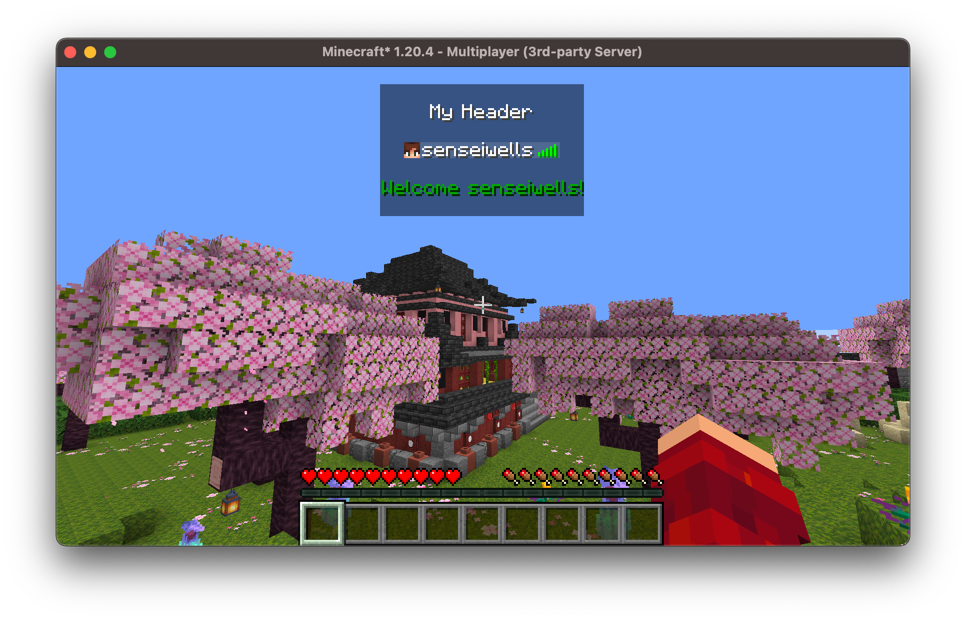

# Tab Display

The tab list is a key part of minigames, it displays information about all the current
players online. Arcade extends this functionality by giving you full control of what is
displayed in the tab display.

To create a tab display, we construct a `VirtualPlayerList`. It needs the server it
belongs to, and some `PlayerListEntries`, which the next section discusses in more detail.

```kotlin
val entries = VanillaPlayerListEntries()
val list = VirtualPlayerList(server, entries)

list.startObservingAndSendPackets(player.asObserver())
```

## Player List Entries

The first thing we will be looking at configuring is the player list entries, these are
the players that are actually listed when you press `tab`. In vanilla this displays
**all** online players, however this may not be desirable. Further, perhaps you don't like
the order vanilla sorts the player list entries by, we also have full control of that. Or
maybe you don't even want to display the online players there, display whatever you
please.

The `PlayerListEntries` interface is how we can configure what is displayed in tab, it
contains a `size` field dictating how many entries there are, the `getEntryAt` method
which gets an entry at a given index, and a `tick` method for updating the entries.

There are some existing implementations of `PlayerListEntries`:
- `VanillaPlayerListEntries` - an implementation of `PlayerListEntries` that imitates
vanilla behaviour
- `TeamListEntries` - displays players, grouped by teams in a nicely organized way
- `MinigamePlayerListEntries` - only displays players in the specified minigame
(requires the minigame module)

The `TeamListEntries` however requires some resource packs which are provided by Arcade,
namely a resource pack to player heads, hide player heads, player ping, and a negative
padding resource pack. More information about these packs in the
[Resources Section](../arcade-resource-pack/getting-started.md)

Here's an example of what `TeamListEntries` look like:


You can extend this class to modify the formatting and customize what teams are displayed.

Unlike the header and footer, the entries are displayed to every player observing the
tab display, they cannot be overridden on a per-player basis.

### Implementing Your Own

Alternatively, you can implement your own `PlayerListEntries` by implementing the
interface:

```kotlin
class MyPlayerListEntries: PlayerListEntries {
    override val size: Int
        get() = TODO("Not yet implemented")

    override fun getEntryAt(index: Int): PlayerListEntries.Entry {
        TODO("Not yet implemented")
    }
}
```

Each `Entry` consists of a `display` which is the text component displayed as the name,
the `textures` which is a base64 encoded signed texture JSON which are used for Minecraft
skins, this determines the head that's rendered, and a latency which renders the latency
sprite.

We can create a vanilla-like player entry by calling the utility method
`PlayerListEntries.Entry#fromPlayer` which will create an entry for a given player.
Alternatively if you want a blank entry (no player head and no latency) you can call
`PlayerListEntries.Entry#fromComponent`, in order for players to view this correctly they
need the resource packs as previously mentioned. And finally, you can create your own
entries, ensure that if you use your own textures for player heads, you ensure they have a
valid signature, otherwise they will not render properly.

## Header and Footer

The header and footer are [values](values.md), so we can set what all our players are
displayed, as well as overriding it for a single player:

```kotlin
val list = VirtualPlayerList(server, VanillaPlayerListEntries())

list.header.set(Component.literal("\nMy Header\n"))
list.footer.set(Component.literal("\nWelcome!\n"))

// Only this player sees their name
list.footer.set(player, Component.literal("\nWelcome ${player.scoreboardName}!\n").green())
```

This will look like so:



These can also be generated from [elements](elements.md) by using a
`DynamicVirtualPlayerList`:

```kotlin
val list = DynamicVirtualPlayerList(server, VanillaPlayerListEntries())

list.setHeader(UniversalElement.constant(Component.literal("\nMy Header\n")))
list.setFooter { player -> Component.literal("\nWelcome ${player.scoreboardName}!\n").green() }
```

## Hiding Real Players

Since the entries we display are virtual, the real players on the server would otherwise
be listed alongside them. This is handled for us, any player observing a
`VirtualPlayerList` will not be listed the real players on the server.

If this isn't what you want, you can change this behaviour by overriding
`replacePlayerInfoUpdatePacket`:

```kotlin
class MyPlayerList(server: MinecraftServer): VirtualPlayerList(server, VanillaPlayerListEntries()) {
    override fun replacePlayerInfoUpdatePacket(
        receiver: ServerPlayer,
        packet: ClientboundPlayerInfoUpdatePacket
    ): ClientboundPlayerInfoUpdatePacket {
        // Let the real players through
        return packet
    }
}
```
