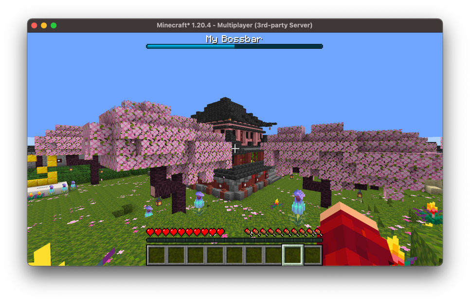
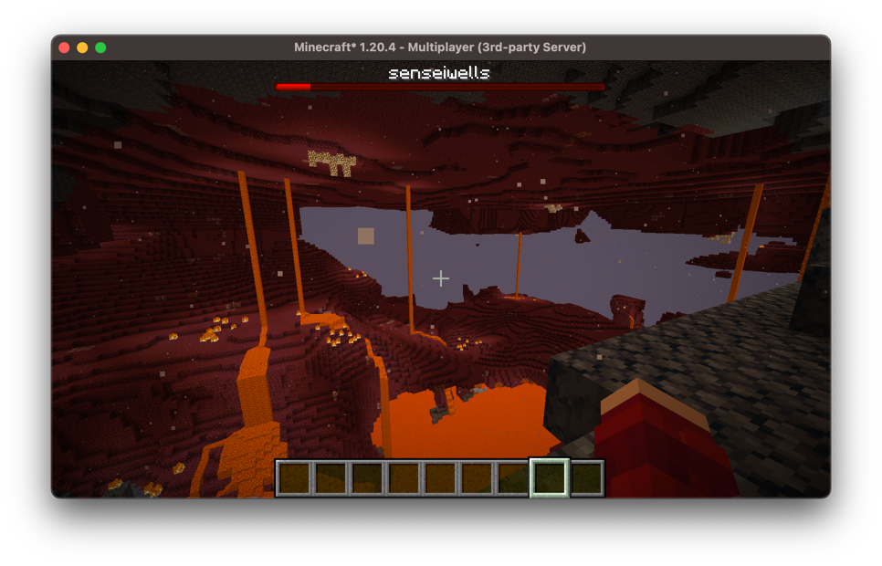

# Bossbars

Bossbars are great for displaying ui at the top of the player's screen, 
they're useful as you're able to display multiple bossbars at a time.

## Static Bossbars

The most simple bossbar we can create would be static, that is everything about the 
bossbar is constant. We can create one of these by constructing a `StaticBossbar`:

```kotlin
val bossbar = StaticBossbar(
    title = Component.literal("My Bossbar"),
    progress = 0.5F,
    color = BossEvent.BossBarColor.BLUE,
    overlay = BossEvent.BossBarOverlay.PROGRESS,
    dark = false,
    music = false,
    fog = false
)

val player = // ...
bossbar.addPlayer(player)
```

This will result in the following bossbar:


## Dynamic Bossbars

We have two ways of creating dynamic bossbars, the first is utilizing `PlayerSpecificElement`s. We can construct a `SuppliedBossBar`:
```kotlin
val bossbar = SuppliedBossbar()
bossbar.setTitle { player -> player.displayName }
// Progresses throughout a minecraft day
bossbar.setProgress(UniversalElement { server ->
    (server.tickCount % 24_000) / 24_000.0F
}.cached())
// Set the color and overlay of the bossbar
bossbar.setStyle(
    LevelSpecificElement { level -> 
        when (level.dimension()) {
            Level.NETHER -> BossEvent.BossBarColor.RED
            Level.END -> BossEvent.BossBarColor.PURPLE
            else -> BossEvent.BossBarColor.BLUE
        }
    },
    BossbarOverlayElements.progress()
)
```

This results in the following bossbar:


We can also directly extend the `CustomBossbar` class and implement our own methods, if you'd prefer:
```kotlin
class MyCustomBossbar: CustomBossbar() {
    override fun getTitle(player: ServerPlayer): Component {
        TODO("Not yet implemented")
    }

    override fun getColor(player: ServerPlayer): BossEvent.BossBarColor {
        return super.getColor(player)
    }

    override fun getOverlay(player: ServerPlayer): BossEvent.BossBarOverlay {
        return super.getOverlay(player)
    }

    override fun getProgress(player: ServerPlayer): Float {
        return super.getProgress(player)
    }

    override fun hasFog(player: ServerPlayer): Boolean {
        return super.hasFog(player)
    }

    override fun hasMusic(player: ServerPlayer): Boolean {
        return super.hasMusic(player)
    }

    override fun isDark(player: ServerPlayer): Boolean {
        return super.isDark(player)
    }
}
```

## Timer Bossbars

Bossbars are great for displaying timers due to their nature of having a progress bar. 
Arcade provides a `TimerBossbar` class which allows you to create such timers and display them.

Similar to a `CustomBossbar` you must extend it and create your own implementation for the bossbar methods:
```kotlin
class MyCustomTimerBossbar: TimerBossbar() {
    override fun getTitle(player: ServerPlayer): Component {
        TODO("Not yet implemented")
    }

    // ...
}
```

Typically, for these bossbars you *do not* want to override the `getProgress` method 
as this is calculated for you based on the remaining time. However, if you want your 
bossbar to be smaller, you may want to scale the progress.

```kotlin
class MyCustomTimerBossbar: TimerBossBar() {
    // ...
    
    override fun getProgress(player: ServerPlayer): Float {
        return MathUtils.centeredScale(this.getProgress(), 0.75F)
    }
    
    // ...
}
```

For example, like the grace bossbar in the image below, to achieve this effect, you 
can create a resource pack and change one of the bossbar color textures to be shorter.


Once you have your bossbar implemented, we can now make use of the timing features.

```kotlin
val bossbar: TimerBossBar = MyCustomTimerBossbar()
// Resets the timer and sets the duration to 10-minutes
bossbar.setDuration(10.Minutes)

// Doesn't reset the timer, instead sets it to finish in 5-minutes from now
bossbar.setRemainingDuration(5.Minutes)

// Unset the timer
bossbar.removeDuration()

bossbar.setDuration(1.Minutes)
bossbar.then {
    println("This task will run after the timer finishes!")
}
```

These timing features are great for displaying when phases will end in minigames, 
like in the above example to show when the grace period ends.

> [!NOTE]
> In order for the `TimerBossbar` to countdown you must call the `tick` on it. 
> If you've added this bossbar to a minigame, this will be handled for you.
