# Usage

## Screens

Arcade makes use of [sgui](https://github.com/Patbox/sgui) for server-sided screens. 
It's likely that for most custom screens you will want to use this; however, 
Arcade does provide some additional utilities.

### Selection Screens

Arcade provides a builder to create selection type screens, these are screens where 
you want to prompt the player with multiple options (possibly with multiple pages), 
and where the user can select one of the options.

Let's have a look at the `SelectionGuiBuilder`, we can construct one by providing 
the player that we're going to display the gui to:

```kotlin
val player: ServerPlayer = // ...
val builder = SelectionGuiBuilder(player)
```

Alternatively, we can construct a gui builder from an existing gui:
```kotlin
val gui: GuiInterface = // Parent gui ...
val builder = SelectionGuiBuilder(gui)
```

We can also add a parent gui later:
```kotlin
builder.parent(gui)
```

If a parent gui is specified the selection screen will return to the parent when 
exited.

#### Adding Elements

From here we can add elements to the selection gui manually like such:
```kotlin
val element = GuiElementBuilder()
    .setItem(Items.DIAMOND)
    .setCallback { slot, click, action, gui -> /* Action when clicked */ }
    .build()
builder.element(element)
```

Or for the more likely case where you're trying to display a collection of elements 
we can call `SelectionGuiBuilder#elements`:

```kotlin
// We want to display players with their heads

val players: Collection<ServerPlayer> = // ...
builder.elements(
    players, 
    { player -> ItemUtils.generatePlayerHead(player.scoreboardName) },
    { slot, click, action, gui, player -> /* Action when clicked */ }
)
```

This is how we add our selectable elements, however, simply just doing this gives 
us no control over how these elements are displayed.

#### Styles

We can customize and configure how elements are displayed in our menus. By default, 
this will be from left to right and top to bottom, until the page is full, then the 
next page will continue displaying elements:

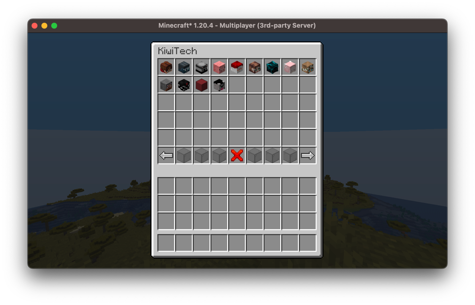

We can customize this by specifying a style; this determines which slots in the gui 
can be filled with our selectable elements.

This is defined using the `SelectionGuiStyle` interface which provides a `getSlots` 
method, this provides a collection of all the slots (in order) in which the selection 
gui will fill elements.

There are some basic styles already implemented, for example `SelectionGuiStyle#centered` 
provides a style that puts all the elements in the center of the page:

```kotlin
builder.style = SelectionGuiStyle.centered(width = 5, height = 3)
```

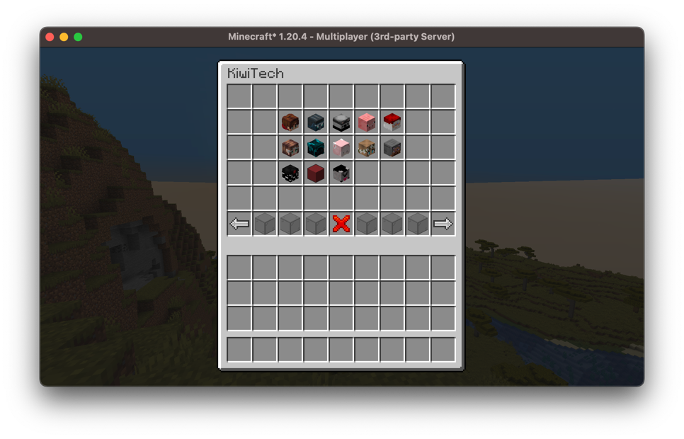

#### Components

We can define the components the selection screen renders, those being the title of 
the screen, as well as the default menu buttons (previous page, next page, exit). 
As you can see in the examples above, they use custom item models to provide cleaner 
buttons; by default, vanilla items are used.

We can customize these with the `SelectionGuiBuilder#components` method:
```kotlin
builder.components {
    // Title of your screen
    title = Component.literal("My Selection Screen")
    
    // Present will render if there is a previous page, absent if not
    previous(present = ItemStack(Items.RED_WOOL), absent = ItemStack(Items.GRAY_WOOL))
    // Back will render if there is a parent page to return to, exit if it will exit this gui
    back(back = ItemStack(Items.ARROW), exit = ItemStack(Items.RED_STAINED_GLASS))
    
    next(present = ItemStack(Items.GREEN_WOOL), absent = ItemStack(Items.GRAY_WOOL))
    
    // The filler items for the rest of the menu bar
    filler(ItemStack(Items.LIGHT_GRAY_WOOL))
}
```

#### Menu Elements

You may want to add additional menu functionality, for example, a button that jumps 
multiple pages. We can do this with menu elements.

We have a total of six menu slots we can override, these will be the same for each 
page of your gui. We can add them using the `SelectionGuiBuilder#menuElement` method:

```kotlin
// Similar to how we add individual elements
val element: GuiElementInterface = // ...
builder.menuElement(MenuSlot.SIX, element)
```

#### Displaying the Screen

Once you've finished adding elements and configuring your builder, you can build it 
and display it to the player which we specified earlier:
```kotlin
builder.build().open()
```

## Player Specific Elements

Before we continue looking at any more gui components, the majority of them rely on 
Arcade's `PlayerSpecificElement`s, so let's take a quick look at what they are and 
what purpose they serve.

Most GUI elements are player-dependent meaning that they can display different 
elements to different players, meaning if you want to display the stat for the 
viewing player, it's extremely easy to do.

We can create such an element like so:
```kotlin
// An element that returns the player's display name
val element = PlayerSpecificElement<Component> { player -> player.displayName }
```

For the example above the element generator will be run everytime we call 
`element.get(player)`, however, in a lot of cases it's likely that the element will 
not be changing between ticks. If your generator is expensive, it may be worth considering 
caching your element:
```kotlin
val element = PlayerSpecificElement<Component> { player ->
    /* Expensive function */
    Component.literal("Foo Bar")
}.cached()
```

This does mean you need to constantly tick your element to keep it updated but prevents 
you unnecessarily calling the expensive function multiple times.

Further, we can merge elements:
```kotlin
val teamElement: PlayerSpecificElement<PlayerTeam> = // ...
val messageElement: PlayerSpecificElement<String> = // ...

val componentElement: PlayerSpecificElement<Component> = teamElement.merge(messageElement) { team, message ->
    team.formattedDisplayName.append(" ").append(message)
}
```

### Other Type-Specific Elements

There are other type-specific elements: `LevelSpecficElement`, `TeamSpecificElement`, and `UniversalElement`, 
these all inherit from `PlayerSpecificElement`, let's also take a quick look at these:

- `LevelSpecificElement`: this is an element that displays based on the world. 
This may be useful if you want to display information about the current world a 
player is in, this can then be cached on a level basis.
- `TeamSpecificElement`: this is an element that displays based on a player team. 
Similarly to the level element, this may be useful if you want to display information 
about a player's team, which can then be cached on a team basis.
- `UniversalElement`: this is an element that displays the same universally. 
This may be useful for elements that will always be displayed the same to **all** 
players.

`UniversalElements` can also be constant, if there is no need to constantly update it's content:
```kotlin
val element: UniversalElement<Component> = UniversalElement.constant(Component.literal("This is constant!"))
```

And similarly to `PlayerSpecificElements` we can create a cached universal element 
that will be updated only once per tick:
```kotlin
val element: UniversalElement<Int> = UniversalElement { server ->
    /* Expensive function */
    server.tickCount
}.cached()
```

## Player Interfaces

Most GUI elements that we're going to discuss will inherit the class `PlayerUI`, 
this is a class that just manages what players are able to view a given gui component, 
keeps track of who is watching what and how often the ui should be updated.

Whether it's a sidebar, bossbar, or tab display, we can add, remove, and clear players:
```kotlin
val player: ServerPlayer = // ...
val uiComponent: PlayerUI = // ...

// Player can now view this ui component
uiComponent.addPlayer(player)
// Player cannot view this ui component anymore
uiComponent.removePlayer(player)
// Removes all watching players
uiComponent.clearPlayers()
// Gets all watching players
val watching: List<ServerPlayer> = uiComponent.getPlayers()
```

And we can change the update interval, this just specifies how many ticks should 
occur before the ui recalculates its state and sends updates to watching players. 
By default, this will happen every tick.
```kotlin
val uiComponent: PlayerUI = // ...
// An update will now happen every second
uiComponent.setInterval(20)
```

> [!NOTE]
> If you're using these GUI components in a minigame, the minigame will handle all 
> the player management for you, see the section on [Minigame GUI](../arcade-minigames/gui.md) 
> for more information.

## Sidebar

The sidebar is a very powerful tool that minigames have to display user interfaces. 
Arcade provides an api to display ui on a per-player basis dynamically. 
We can display up to 14 lines of text on the side of our player's screens.

Let's take a look at the `Sidebar` class, this manages a sidebar for our players. 
We can construct our sidebar providing a `PlayerSpecificElement<Component>` for the 
title of the sidebar:

```kotlin
// The ComponentElement object provides some utilities
val sidebar = Sidebar(ComponentElements.of(Component.literal("Sidebar Title")))
```

To add rows to our sidebar we must first discuss `SidebarComponents`, which is just 
a data class which holds the display element component as well as a score component, 
the display element will be aligned to the left, and the score component will be 
aligned to the right. We can create a `SidebarComponent` as follows:
```kotlin
SidebarComponent.withNoScore(Component.literal("My Display Element"))

SidebarComponent.withCustomScore(
    Component.literal("My Display Score"),
    Component.literal("My Right-Aligned Score!")
)
```

Now we can add these components to our `ArcadeSidebar` using the 
`ArcadeSidebar#addRow` method. This takes in `PlayerSpecificElement<SidebarComponent>`. 
By default `addRow` will append the rows to the bottom of the sidebar, you can also 
specify the index at which you want to insert your element using 
`addRow(index, element)`, or if you want to overwrite a row you can use 
`setRow(index, element)`.
```kotlin
val sidebar = Sidebar(ComponentElements.of(Component.literal("Sidebar Title")))

val displayElement = SidebarComponent.withNoScore(Component.literal("My Display Element"))
sidebar.addRow(UniversalElement.constant(displayElement))

val displayScore = SidebarComponent.withCustomScore(
    Component.literal("My Display Score"),
    Component.literal("My Right-Aligned Score!")
)
sidebar.addRow(UniversalElement.constant(displayScore))
```

These elements would result in a sidebar looking like so:
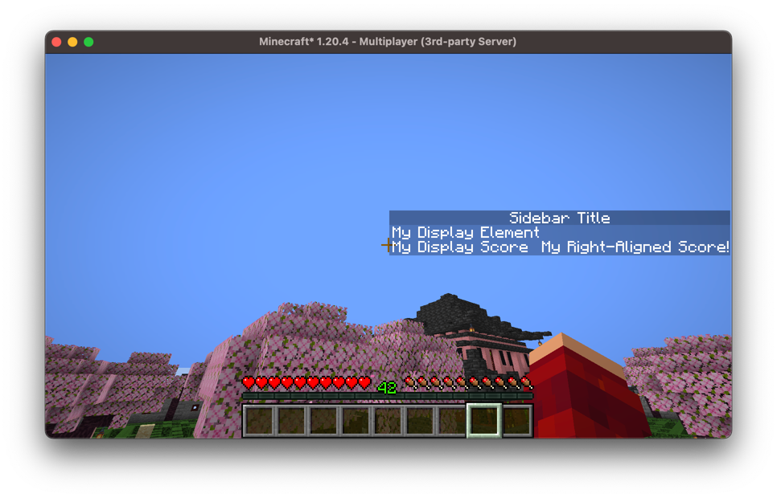

Now lets make our sidebar dynamic, providing some updatable elements:
```kotlin
val sidebar = Sidebar(ComponentElements.of(Component.literal("Sidebar Title")))

// Empty sidebar component
sidebar.addRow(SidebarElements.empty())
// Displays the player's xp level
sidebar.addRow { player ->
    SidebarComponent.withCustomScore(
        Component.literal("XP Level").bold(),
        Component.literal(player.experienceLevel.toString()).purple()
    )
}
// Displays the server's current tick
sidebar.addRow(UniversalElement { server ->
    SidebarComponent.withCustomScore(
        Component.literal("Ticks").italicise(),
        Component.literal(server.tickCount.toString()).lime()
    )
}.cached())
// Empty sidebar component
sidebar.addRow(SidebarElements.empty())
```

In game this looks like so:
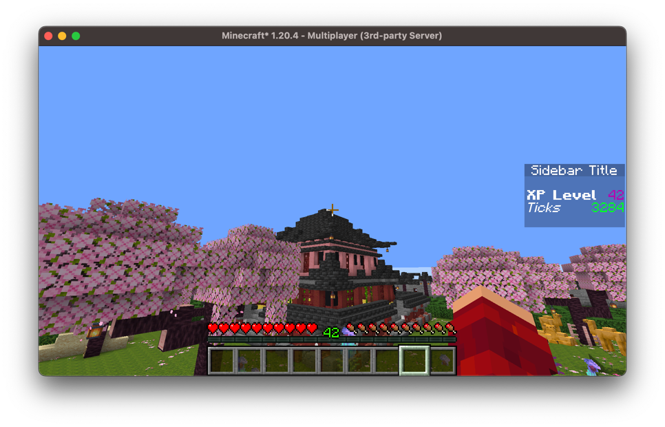

## Bossbars

Bossbars are great for displaying ui at the top of the player's screen, 
they're useful as you're able to display multiple bossbars at a time.

### Static Bossbars

The most simple bossbar we can create would be static, that is everything about the 
bossbar is constant. We can create one of these by constructing a `StaticBossbar`:

```kotlin
val bossbar = StaticBossbar(
    title = Component.literal("My Bossbar"),
    progress = 0.5F,
    colour = BossEvent.BossBarColor.BLUE,
    overlay = BossEvent.BossBarOverlay.PROGRESS,
    dark = false,
    music = false,
    fog = false
)

val player = // ...
bossbar.addPlayer(player)
```

This will result in the following bossbar:
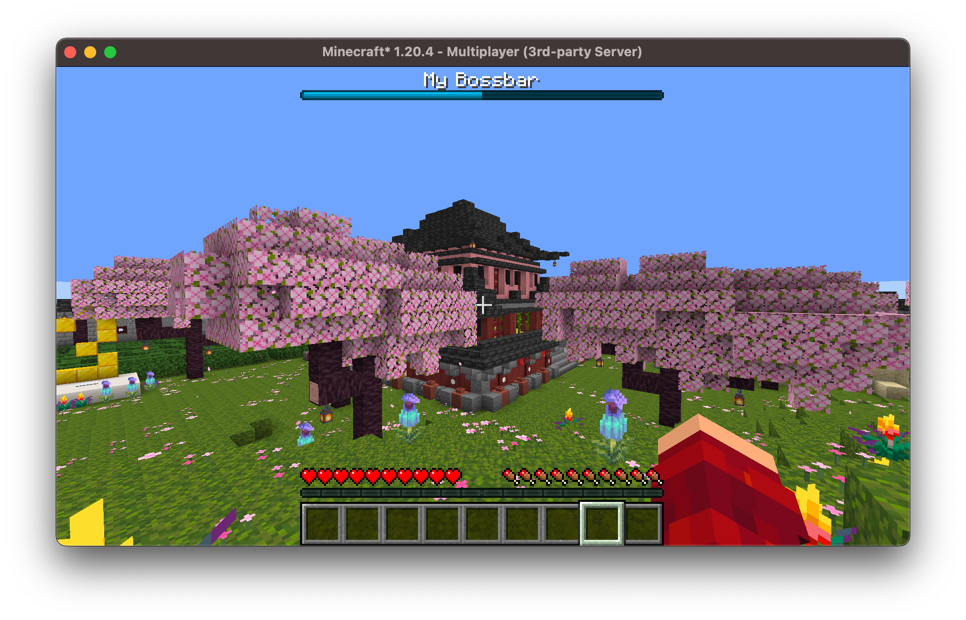

### Dynamic Bossbars

We have two ways of creating dynamic bossbars, the first is utilizing `PlayerSpecificElement`s. We can construct a `SuppliedBossBar`:
```kotlin
val bossbar = SuppliedBossbar()
bossbar.setTitle { player -> player.displayName }
// Progresses throughout a minecraft day
bossbar.setProgress(UniversalElement { server ->
    (server.tickCount % 24_000) / 24_000.0F
}.cached())
// Set the colour and overlay of the bossbar
bossbar.setStyle(
    LevelSpecificElement { level -> 
        when (level.dimension()) {
            Level.NETHER -> BossEvent.BossBarColor.RED
            Level.END -> BossEvent.BossBarColor.PURPLE
            else -> BossEvent.BossBarColor.BLUE
        }
    },
    OverlayElements.progress()
)
```

This results in the following bossbar:
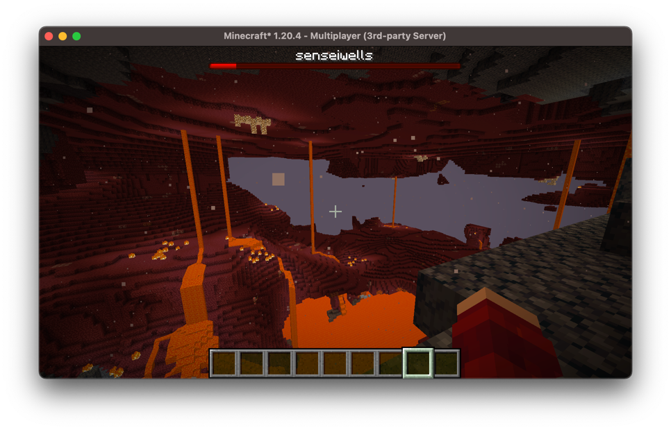

We can also directly extend the `CustomBossbar` class and implement our own methods, if you'd prefer:
```kotlin
class MyCustomBossbar: CustomBossbar() {
    override fun getTitle(player: ServerPlayer): Component {
        TODO("Not yet implemented")
    }

    override fun getColour(player: ServerPlayer): BossEvent.BossBarColor {
        return super.getColour(player)
    }

    override fun getOverlay(player: ServerPlayer): BossEvent.BossBarOverlay {
        return super.getOverlay(player)
    }

    override fun getProgress(player: ServerPlayer): Float {
        return super.getProgress(player)
    }

    override fun hasFog(player: ServerPlayer): Boolean {
        return super.hasFog(player)
    }

    override fun hasMusic(player: ServerPlayer): Boolean {
        return super.hasMusic(player)
    }

    override fun isDark(player: ServerPlayer): Boolean {
        return super.isDark(player)
    }
}
```

### Timer Bossbars

Bossbars are great for displaying timers due to their nature of having a progress bar. 
Arcade provides a `TimerBossbar` class which allows you to create such timers and display them.

Similar to a `CustomBossbar` you must extend it and create your own implementation for the bossbar methods:
```kotlin
class MyCustomTimerBossbar: TimerBossbar() {
    override fun getTitle(player: ServerPlayer): Component {
        TODO("Not yet implemented")
    }

    // ...
}
```

Typically, for these bossbars you *do not* want to override the `getProgress` method 
as this is calculated for you based on the remaining time. However, if you want your 
bossbar to be smaller, you may want to scale the progress.

```kotlin
class MyCustomTimerBossbar: TimerBossBar() {
    // ...
    
    override fun getProgress(player: ServerPlayer): Float {
        return MathUtils.centeredScale(this.getProgress(), 0.75F)
    }
    
    // ...
}
```

For example, like the grace bossbar in the image below, to achieve this effect, you 
can create a resource pack and change one of the bossbar colour textures to be shorter.

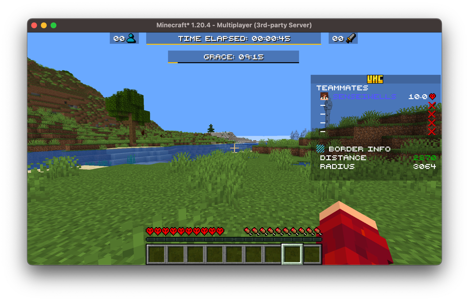

Once you have your bossbar implemented, we can now make use of the timing features.

```kotlin
val bossbar: TimerBossBar = MyCustomTimerBossbar()
// Resets the timer and sets the duration to 10-minutes
bossbar.setDuration(10.Minutes)

// Doesn't reset the timer, instead sets it to finish in 5-minutes from now
bossbar.setRemainingDuration(5.Minutes)

// Unset the timer
bossbar.removeDuration()

bossbar.setDuration(1.Minutes)
bossbar.then {
    println("This task will run after the timer finishes!")
}
```

These timing features are great for displaying when phases will end in minigames, 
like in the above example to show when the grace period ends.

> [!NOTE]
> In order for the `TimerBossbar` to countdown you must call the `tick` on it. 
> If you've added this bossbar to a minigame, this will be handled for you.

## Tab Display

The tab list is a key part of minigames, it displays information about all the 
current players online. Arcade extends this functionality by giving you full control 
of what is displayed in the tab display.

To create a tab display, we can construct an instance of `PlayerListDisplay`, 
as with the bossbars and sidebar this extends `PlayerUI`. 
To construct this we need to provide some `PlayerListEntries`, the next section will 
discuss this in more detail.

```kotlin
val entries = VanillaPlayerListEntries()
val display = PlayerListDisplay(entries)
```

### Player List Entries

The first thing we will be looking at configuring is the player list entries, 
these are the players that are actually listed when you press `tab`. In vanilla this 
displays **all** online players, however this may not be desirable. Further, perhaps 
you don't like the order vanilla sorts the player list entries by, we also have full 
control of that. Or maybe you don't even want to display the online players there, 
display whatever you please.

The `PlayerListEntries` interface is how we can configure what is displayed in tab, 
it contains a `size` field dictating how many entries there are, the `getEntryAt` 
method which gets an entry at a given index, and a `tick` method for updating the 
entries.

There are some existing implementations of `PlayerListEntries`:
- `VanillaPlayerListEntries` - an implementation of `PlayerListEntries` that imitates 
vanilla behaviour
- `TeamListEntries` - displays players, grouped by teams in a nicely organized way
- `MinigamePlayerListEntries` - only displays players in the specified minigame
(requires the minigame module)

The `TeamListEntries` however requires some resource packs which are provided by 
Arcade, namely a resource pack to player heads, hide player heads, player ping, and 
a negative padding resource pack. More information about these packs in the 
[Resources Section](../arcade-resource-pack/getting-started.md)

Here's an example of what `TeamListEntries` look like:

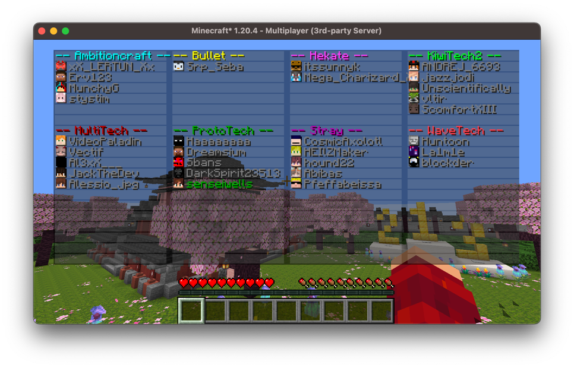

You can extend this class to modify the formatting and customize what teams are 
displayed.

#### Implementing Your Own

Alternatively, you can implement your own `PlayerListEntries` by implementing the 
interface:

```kotlin
class MyPlayerListEntries: PlayerListEntries {
    override val size: Int
        get() = TODO("Not yet implemented")

    override fun getEntryAt(index: Int): PlayerListEntries.Entry {
        TODO("Not yet implemented")
    }
}
```

Each `Entry` consists of a `display` which is the text component displayed as the 
name, the `textures` which is a base64 encoded signed texture JSON which are used 
for Minecraft skins, this determines the head that's rendered, and a latency which 
renders the latency sprite.

We can create a vanilla-like player entry by calling the utility method 
`PlayerListEntries.Entry#fromPlayer` which will create an entry for a given player. 
Alternatively if you want a blank entry (no player head and no latency) you can call 
`PlayerListEntries.Entry#fromComponent`, in order for players to view this correctly 
they need the resource packs as previously mentioned. And finally, you can create 
your own entries, ensure that if you use your own textures for player heads, you 
ensure they have a valid signature, otherwise they will not render properly.

### Header and Footer

The header and footer for the tab display are very easy to configure, they're very 
similar to how bossbars are handled, we just provide some 
`PlayerSpecificElement<Component>`s as a header and footer:
```kotlin
val display = PlayerListDisplay(VanillaPlayerListEntries())
    
display.setDisplay(
    header = UniversalElement.constant(Component.literal("\nMy Header\n")),
    footer = { player -> Component.literal("\nWelcome ${player.scoreboardName}!\n").green() }
)
```

This will look like so:

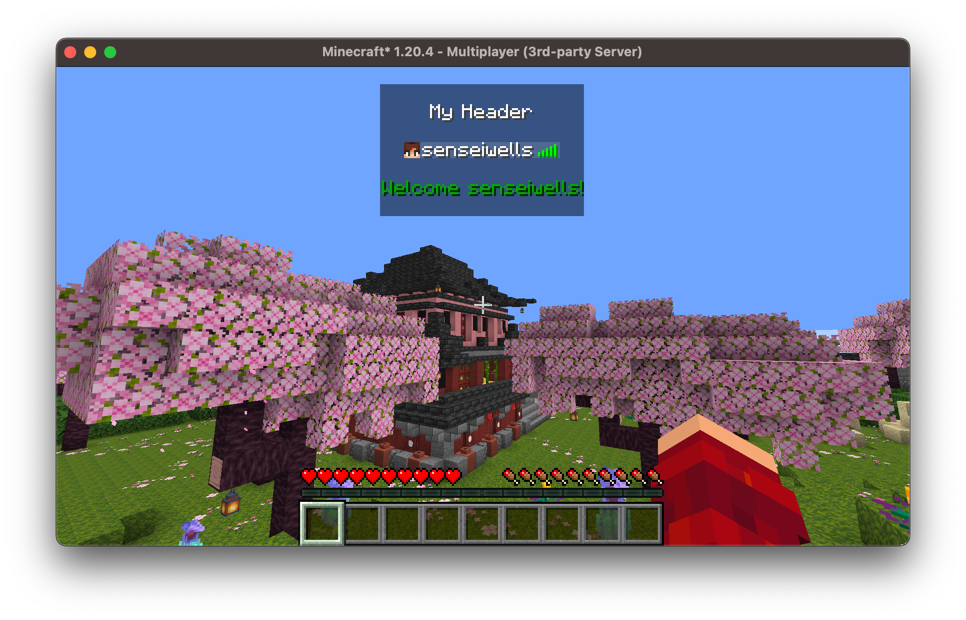

## Nametags

Nametags in vanilla are quite limiting, you can only have two nametags, and you have 
very little configurability over what is displayed on them. Arcade allows you to 
have more control by using [CustomNameTags](https://github.com/senseiwells/CustomNameTags). 
Arcade implements this system into it's `PlayerUI` system and uses `PlayerSpecificElement<Component>`s 
to determine what is displayed on the nametag. Arcade's nametags also allow you to 
configure who can see which nametags.

To create a basic nametag we just construct `PlayerNameTag` providing it a 
`PlayerSpecificElement<Component>`:

```kotlin
val nametag = PlayerNameTag({ player -> Component.literal("[CNT] ").append(player.displayName) })
```
Adding players to this nametag will make the nametag display for these players:
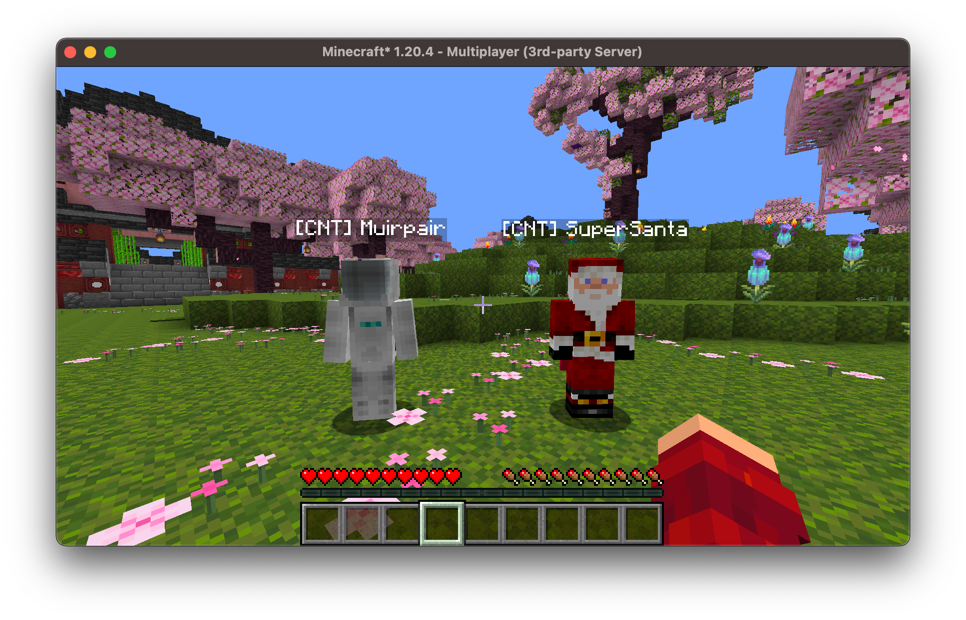

And we can add as many nametags as we please with this system:
```kotlin
val nametag = PlayerNameTag({ player -> Component.literal("[CNT] ").append(player.displayName) })
nametag.addPlayer(/* */)

val nametagTwo = PlayerNameTag(ComponentElements.of(Component.literal("Electric Boogaloo")))
nametagTwo.addPlayer(/* */)
```

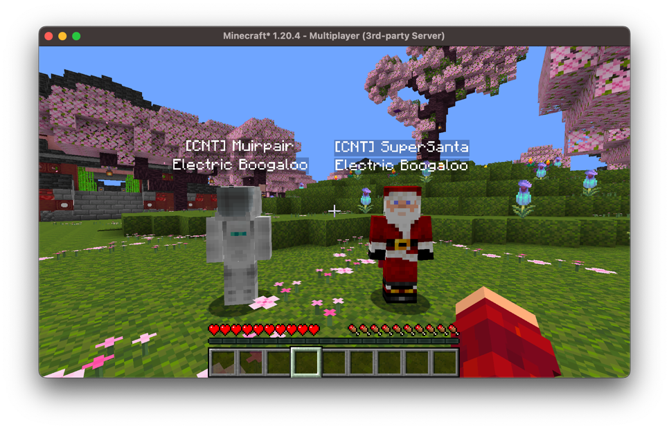

Now, what if we only want to display some nametags under certain conditions. 
We can make use of `PlayerNameTag`'s observer predicates. This is a functional 
interface which takes in two `ServerPlayer`s (the first being the **observee**, 
the second being the **observer**) and returns whether the **observer** should be 
able to observe the **observee**.

```kotlin
val nametag = PlayerNameTag({ player -> Component.literal("[CNT] ").append(player.displayName) })
val healthTag = PlayerNameTag({ player -> Component.literal("${player.health} ❤") })

val healthWarningTag = PlayerNameTag(
    ComponentElements.of(Component.literal("< 5 hearts!")),
    // We say that an observer can only see this nametag if
    // they are in spectator AND the observee is under 5 hearts
    { observee, observer -> observer.isSpectator && observee.health < 10 }
)
```

And below, you can see what this would look like in game:

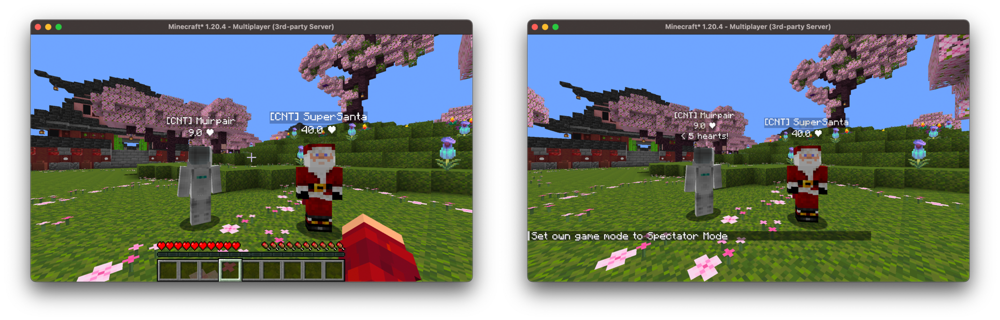

## Other

There are some other small miscellaneous GUI elements that Arcade provides.

### Countdowns

In minigames, it's common to want a countdown. Arcade provides an interface for 
easily creating these. There is a generic `Countdown` interface, as well as a 
`TitledCountdown` interface. The `Countdown` interface is intended for if you wish 
to create a countdown system that doesn't use Minecraft's titles, and for example, 
uses chat instead, but for most cases you will probably want to be using 
`TitledCountdown`s.

To create a titled countdown we can simply call `TitledCountdown#titled`, you can 
optionally pass in your title if you wish it to be different from the default:

```kotlin
val countdown = TitledCountdown.titled()
```

Then to initiate the countdown you call `Countdown#countdown` passing in a duration 
for the countdown, an interval between the counts, a `MinecraftSheduler` implementation, 
and a player provider. By default, the duration will be 10 seconds, the interval 
will be 1 second, the `GlobalTickedScheduler` will be used, and the countdown will 
be broadcasted to all online players.

```kotlin
// Gets all online players
val players: () -> Collection<ServerPlayer> = PlayerUtils::players
countdown.countdown(
    5.Seconds,
    1.Seconds,
    GlobalTickedScheduler.asScheduler(),
    players
)
```

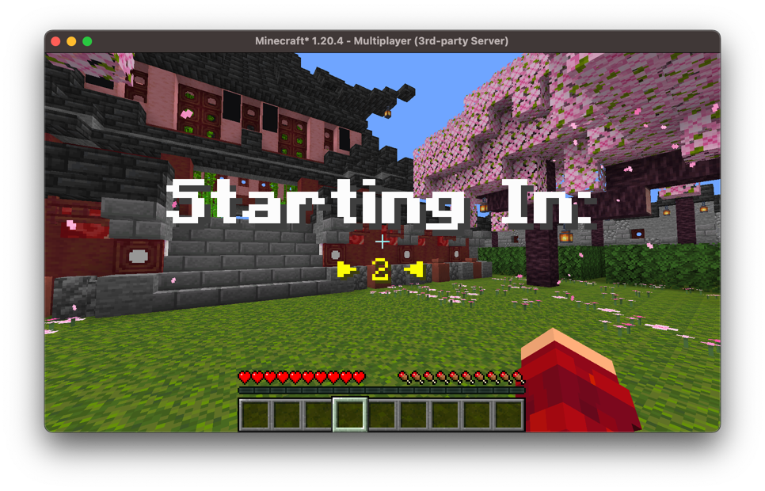

If you want more control over the formatting and display of the `TitledCountdown` 
you can create your own implementation and override the respective methods.
