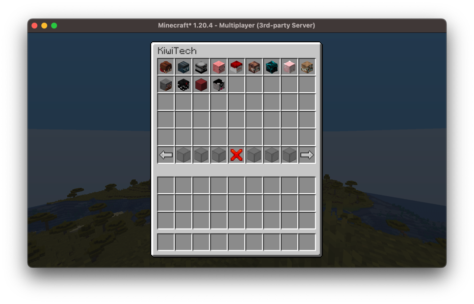
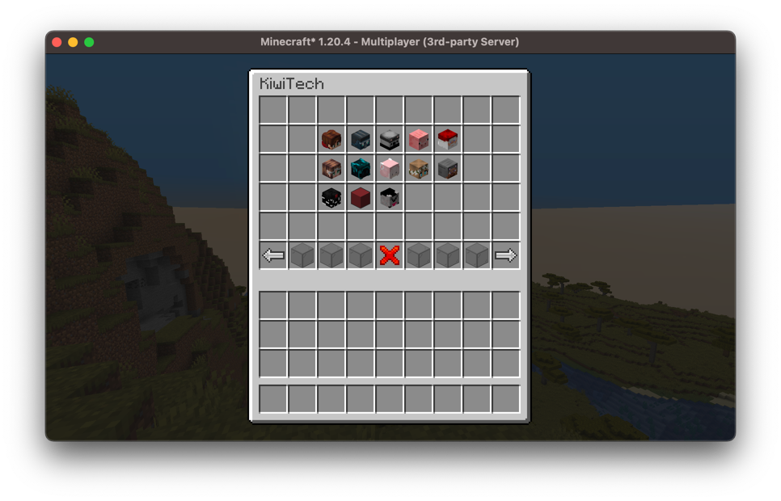

# GUI

Arcade provides a wide array of components for creating user interfaces, for screens, sidebars, bossbars, tab display, nametags, titles, and more.

## Screens

Arcade makes use of [sgui](https://github.com/Patbox/sgui) for server-sided screens. It's likely that for most custom screens you will want to use this; however, Arcade does provide some additional utilities.

### Selection Screens

Arcade provides a builder to create selection type screens, these are screens where you want to prompt the player with multiple options (possibly with multiple pages), and where the user can select one of the options.

Let's have a look at the `SelectionGuiBuilder`, we can construct one by providing the player that we're going to display the gui to:

```kotlin
val player: ServerPlayer = // ...
val builder = SelectionGuiBuilder(player)
```

Alternatively, we can construct a gui builder from an existing gui:
```kotlin
val gui: GuiInterface = // Parent gui ...
val builder = SelectionGuiBuilder(gui)
```

We can also add a parent gui later:
```kotlin
builder.parent(gui)
```

If a parent gui is specified the selection screen will return to the parent when exited.

#### Adding Elements

From here we can add elements to the selection gui manually like such:
```kotlin
val element = GuiElementBuilder()
    .setItem(Items.DIAMOND)
    .setCallback { slot, click, action, gui -> /* Action when clicked */ }
    .build()
builder.element(element)
```

Or for the more likely case where you're trying to display a collection of elements we can call `SelectionGuiBuilder#elements`:

```kotlin
// We want to display players with their heads

val players: Collection<ServerPlayer> = // ...
builder.elements(
    players, 
    { player -> ItemUtils.generatePlayerHead(player.scoreboardName) },
    { slot, click, action, gui, player -> /* Action when clicked */ }
)
```

This is how we add our selectable elements, however, simply just doing this gives us no control over how these elements are displayed.

#### Styles

We can customize and configure how elements are displayed in our menus. By default, this will be from left to right and top to bottom, until the page is full, then the next page will continue displaying elements:



We can customize this by specifying a style; this determines which slots in the gui can be filled with our selectable elements.

This is defined using the `SelectionGuiStyle` interface which provides a `getSlots` method, this provides a collection of all the slots (in order) in which the selection gui will fill elements.

There are some basic styles already implemented, for example `SelectionGuiStyle#centered` provides a style that puts all the elements in the center of the page:

```kotlin
builder.style = SelectionGuiStyle.centered(width = 5, height = 3)
```



#### Components

We can define the components the selection screen renders, those being the title of the screen, as well as the default menu buttons (previous page, next page, exit). As you can see in the examples above, they use custom item models to provide cleaner buttons; by default, vanilla items are used.

We can customize these with the `SelectionGuiBuilder#components` method:
```kotlin
builder.components {
    // Title of your screen
    title = Component.literal("My Selection Screen")
    
    // Present will render if there is a previous page, absent if not
    previous(present = ItemStack(Items.RED_WOOL), absent = ItemStack(Items.GRAY_WOOL))
    // Back will render if there is a parent page to return to, exit if it will exit this gui
    back(back = ItemStack(Items.ARROW), exit = ItemStack(Items.RED_STAINED_GLASS))
    
    next(present = ItemStack(Items.GREEN_WOOL), absent = ItemStack(Items.GRAY_WOOL))
    
    // The filler items for the rest of the menu bar
    filler(ItemStack(Items.LIGHT_GRAY_WOOL))
}
```

#### Menu Elements

You may want to add additional menu functionality, for example, a button that jumps multiple pages. We can do this with menu elements.

We have a total of six menu slots we can override, these will be the same for each page of your gui. We can add them using the `SelectionGuiBuilder#menuElement` method:

```kotlin
// Similar to how we add individual elements
val element: GuiElementInterface = // ...
builder.menuElement(MenuSlot.SIX, element)
```

#### Utilities

The `ScreenUtils` object provides some methods which add some of the most commonly added elements to selection screens, for example, adding spectatable players; adds a collection of players (and their heads), when clicked you teleport to the selected players.

## Sidebar

## Bossbars

## Tab Display

## Nametags

## Titles

## Particles

