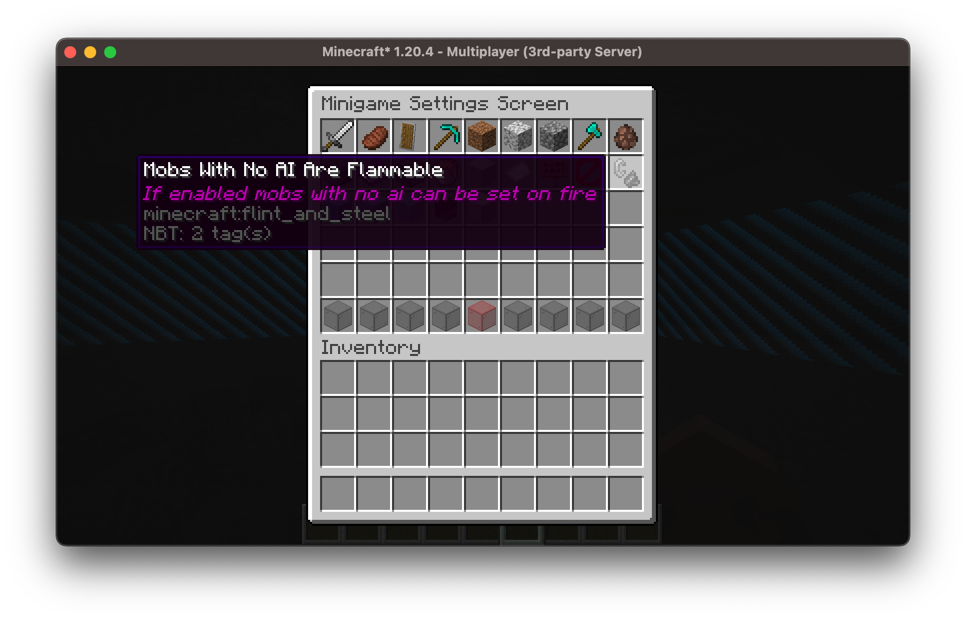
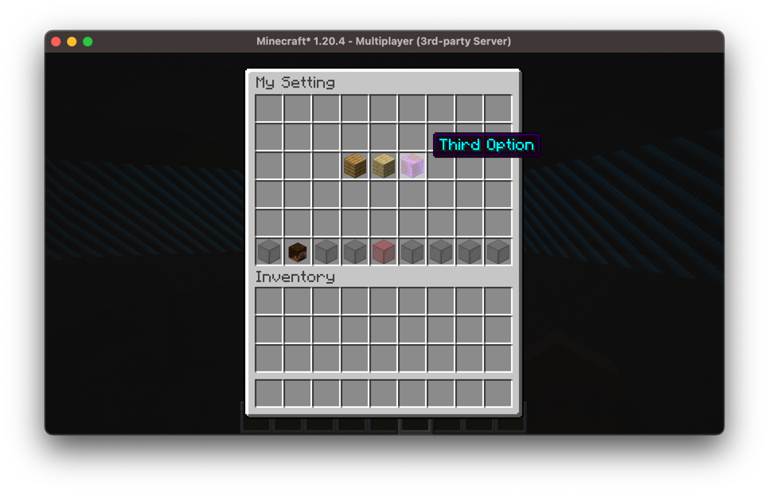
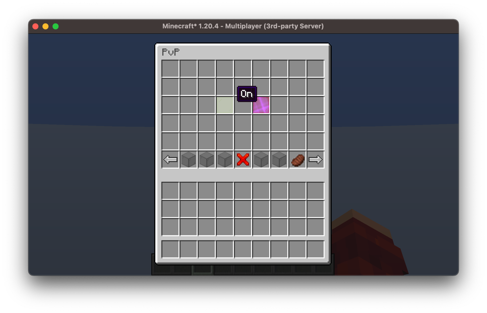
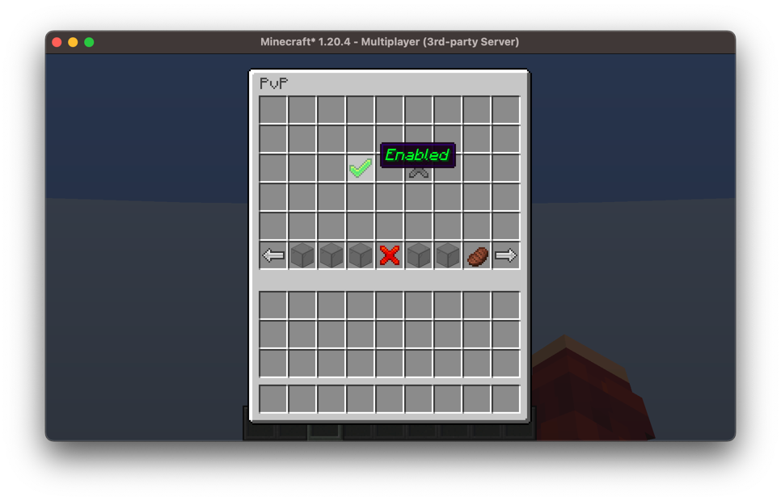

# Settings

> Return to [table of contents](../minigames.md)

Minigame settings are super easy to configure and allow for quite a lot of control over the behaviour of your minigame.

In addition to the built-in default settings you are able to implement your own settings using this system, all the settings are accessible and configurable in-game through a gui.



## Built-In Settings

All the built-in settings are defined in the `MinigameSettings` class, these are accessible through `Minigame#settings`, we'll discuss some of them and what they do.

Let's say we're creating a multi-player parkour minigame, it's likely we don't want players to be able to punch each other, to do this we can simply disable PvP:

```kotlin
minigame.settings.canPvp.set(false)
```

We'd also want the players to stay at full hunger:
```kotlin
minigame.settings.canGetHungry.set(false)
```

And we don't want the player to modify our parkour maps:
```kotlin
minigame.settings.canBreakBlocks.set(false)
minigame.settings.canPlaceBlocks.set(false)
```

There are also some more admin-related settings, for example:
```kotlin
minigame.settings.isChatMuted.set(true)
```
This will mute chat and prevent players from sending messages.

There are also some settings to aid with tick-freezing the minigame, for example, if you want your minigame to freeze all ticking when the minigame is paused:
```kotlin
minigame.settings.tickFreezeOnPause.set(true)
```

Or even if you just want to freeze all entities (including players) at a given moment:
```kotlin
minigame.settings.freezeEntities.set(true)
```

These settings work on a world-wide basis, depending on the worlds you registered for your minigame, it doesn't affect other minigames or worlds that aren't part of your minigame. For more information, go back to the [World Section](./worlds.md).

There are more settings for you to explore, be sure to take a look at the class to see what is available!

## Custom Settings

To create custom settings for your minigame, you first must extend the `MinigameSettings` class.

```kotlin
class ExampleSettings(minigame: Minigame<*>): MinigameSettings(minigame) {

}
```

### Setting Types

The underlying class for all settings is `GameSetting<T>`, this is essentially just a wrapper for some value with any type `T`. However, to make it support a UI, it is wrapped in the `MenuGameSetting<T>` class which provides information about how to display the setting to a player.

We can build `MenuGameSetting<T>`s with a `MenuGameSettingBuilder<T>`, there are a couple built-in types that this supports:
```kotlin
MenuGameSettingBuilder.bool()
MenuGameSettingBuilder.int32()
MenuGameSettingBuilder.int64()
MenuGameSettingBuilder.float32()
MenuGameSettingBuilder.float64()
MenuGameSettingBuilder.time()
MenuGameSettingBuilder.enumeration()
```

These will likely be all you need, however creating your own type is super simple:
```kotlin
// Use Codec<T> for your type, in this example using String
val stringSettingGenerator = GameSetting.generator(Codec.STRING)

fun string(): MenuGameSettingBuilder<String> {
    return MenuGameSettingBuilder(stringSettingGenerator)
}
```

### Building a Custom Setting

Now to use the builder, the first thing we want to do is give the setting a name, and a default value:
```kotlin
val setting: MenuGameSetting<Int> = MenuGameSettingBuilder.int32 {
    name = "my_setting"
    value = 100
}
```

Now we can add a display item to represent this setting:
```kotlin
val setting: MenuGameSetting<Int> = MenuGameSettingBuilder.int32 {
    name = "my_setting"
    value = 100
    display = Items.IRON_BLOCK.named("My Setting")
}
```

And that's the minimum you need to create a `MenuGameSetting`, however it's likely you want to add some options - these will be displayed in-game and allow an admin to set the setting to one of the options.
```kotlin
val setting: MenuGameSetting<Int> = MenuGameSettingBuilder.int32 {
    // ...
    option("first_option", Items.OAK_PLANKS.named("First Option"), 0)
    option("second_option", Items.BIRCH_PLANKS.named("Second Option"), 50)
    option("third_option", Items.SPRUCE_PLANKS.named("Third Option"), 100)
}
```

This will result in the following gui:


We can also add listeners to our setting to get notified when the setting is changed:
```kotlin
val setting: MenuGameSetting<Int> = MenuGameSettingBuilder.int32 {
    // ...
    listener { setting: GameSetting<Int>, value: Int ->
        println("My Setting was set to $value")
    }
}
```

And finally we can add setting overrides, this is for the case of player-specific settings, and is mostly designed to add overrides for administrators. For example, the `isChatMuted` setting has an override that will let any minigame admins bypass the mute.
```kotlin
val setting: MenuGameSetting<Int> = MenuGameSettingBuilder.int32 {
    // ...
    
    // If the player this setting is being applied
    // to is an admin, the value will be 900
    override = isAdminOverride(900)
    
    // This can be any function
    override = { player: ServerPlayer ->
        player.experienceLevel
    }
}
```

### Registering Custom Settings 

Now inside our class we can register our first setting, we can do this by using the `register` method. This takes in a `MenuGameSetting<T>` and returns a `GameSetting<T>`:

```kotlin
class ExampleSettings(minigame: Minigame<*>): MinigameSettings(minigame) {
    val myCustomSetting: GameSetting<Int> = this.register(MenuGameSettingBuilder.int32 {
        name = "my_setting"
        value = 100
        display = Items.IRON_BLOCK.named("My Setting")

        option("first_option", Items.OAK_PLANKS.named("First Option"), 0)
        option("second_option", Items.BIRCH_PLANKS.named("Second Option"), 50)
        option("third_option", Items.SPRUCE_PLANKS.named("Third Option"), 100)

        listener { setting: GameSetting<Int>, value: Int ->
            println("My Setting was set to $value")
        }
        
        override = { player: ServerPlayer ->
            player.experienceLevel
        }
    })
}
```

This will register the setting for the minigame and will add it to the list to be displayed in the gui.

`GameSetting<T>` can also be delegated, this means alternatively we could write our setting like so:
```kotlin
class ExampleSettings(minigame: Minigame<*>): MinigameSettings(minigame) {
    var myCustomSetting: Int by this.register(MenuGameSettingBuilder.int32 {
        // ...
    })
}
```

This means we can directly get and set the value of the setting:
```kotlin
val settings: ExampleSettings = // ...
println("The value of My Custom Setting is: ${setting.myCustomSetting}")
settings.myCustomSetting = 99
```

### Default Options

In our settings class we have access to `this.defaults`, this provides defaults for discrete setting types, for example `GameSetting<Boolean>` can only have two options, one for `true`, and one for `false`. Instead of adding options for these manually, we can just use the defaults:
```kotlin
class ExampleSettings(minigame: Minigame<*>): MinigameSettings(minigame) {
    val myCustomSetting by this.register(MenuGameSettingBuilder.bool {
        // ...
        defaults.options(this)
    })
}
```

The default options for booleans are a green stained-glass pane and red stained-glass pane for enabling and disabling respectively:



However, we can also customize the defaults by extending the `DisplayableSettingsDefaults` class and overriding the `options` method:

```kotlin
class CustomSettingsDefaults: DisplayableSettingsDefaults() {
    override fun options(builder: MenuGameSettingBuilder<Boolean>, enabled: ItemStack, disabled: ItemStack) {
        builder.option("enabled", Items.LIME_WOOL.named("Enable"), true) 
        builder.option("disabled", Items.RED_WOOL.named("Disable"), false) 
    }
}
```
And you can choose any item for your display item, this can also be any custom items with custom models or textures.

Then we can pass this into our `MinigamesSettings` constructor call:
```kotlin
class ExampleSettings(
    minigame: Minigame<*>
): MinigameSettings(minigame, CustomSettingsDefaults()) {
    // ...
}
```

These defaults will then be applied to all settings that use the default options, including the built-in ones.

Here's an example of customized default options:



## Modifying The UI

The settings gui's are build using the Arcade's `SelectionGuiBuilder` which is intended to build gui's for collections of selectable objects. 

This is a super powerful gui tool and is highly configurable, it lets you determine where elements are displayed, and lets you completely customize the menu bar you see at the bottom. 

To customize the builder used when creating these setting guis you can override the `createSettingsGuiBuilder` and `createOptionsGuiBuilder` methods in `DisplayableSettingsDefaults`:

```kotlin
class CustomSettingsDefaults: DisplayableSettingsDefaults() {
    override fun createSettingsGuiBuilder(player: ServerPlayer): SelectionGuiBuilder {
        return super.createSettingsGuiBuilder(player)
    }

    override fun createOptionsGuiBuilder(parent: GuiInterface, setting: MenuGameSetting<*>): SelectionGuiBuilder {
        return super.createOptionsGuiBuilder(parent, setting)
    }
}
```

The `createSettingsGuiBuilder` returns the builder responsible for creating the gui listing all the minigame settings, and the `createOptionsGuiBuilder` returns the builder responsible for creating the gui listing all the options for a given minigame setting.

The specifics on how to customize these are discussed in the [GUI Section](../gui).

> See the next section on [Teams](teams.md)